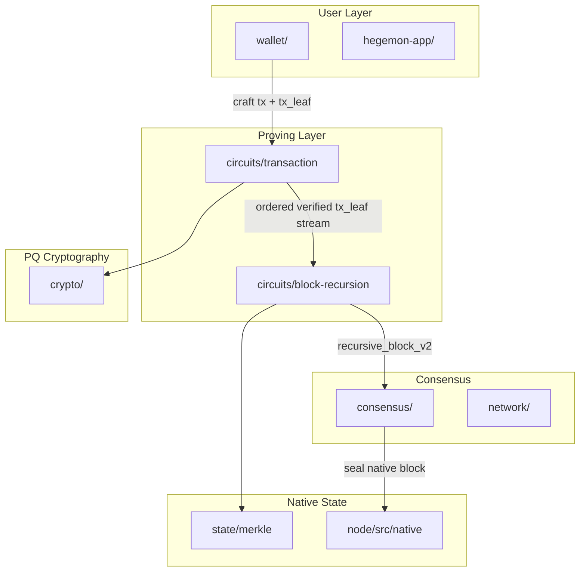
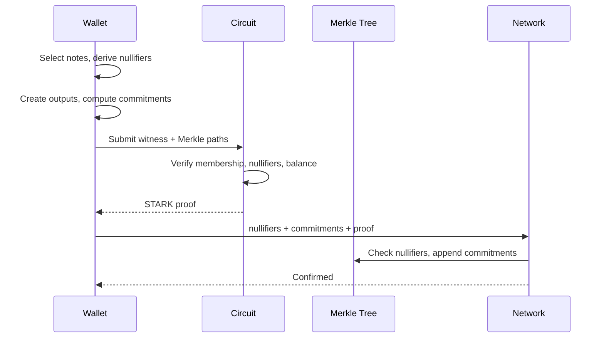

# HEGEMON - Alpha Release

Post-quantum shielded money


## Whitepaper

### Abstract
HEGEMON (HGN) is post-quantum shielded money. The project combines a shielded-only pool, manifest-driven protocol evolution, and permissionless PoW consensus into a self-custodied monetary protocol built to preserve private digital cash under quantum-capable adversaries. This whitepaper summarizes the core principles guiding the repo and connects them to the implementation artifacts contained in this monorepo.

### Motivation
HGN is a shielded-only monetary protocol built for a quantum-adversarial future. The motivation comes from two converging pressures. First, Shor-class adversaries threaten the privacy guarantees of systems that still rely on elliptic curves or pairings. Second, private digital cash still needs local custody, predictable issuance, and the ability to prove specific facts without exposing the rest of a user's history. HGN combines post-quantum cryptography, MASP-style circuits, and explicit protocol-release schedules to deliver that blend. Privacy is a first-order autonomy requirement because transparent ledgers expose balances, counterparties, and behavioral patterns to anyone willing to watch. Once outsiders can scrape that data, they can map relationships, infer strategy, pressure users, or deanonymize activists and businesses alike, making practical financial privacy impossible. The motivating use cases are:

1. **Digital bearer instrument** – Users custody notes locally via the `wallet/` client and transact without revealing balances, ownership, or memo data.
2. **Shielded monetary network** – Miners running the PoW `consensus/` stack secure issuance and confirm shielded value without transparent accounts or a public relationship graph.
3. **Proof of disclosure** – Proofs of disclosure and scoped disclosures let users prove a payment, balance claim, or source-of-funds fact without revealing unrelated history.

### Protocol overview
The HGN protocol consists of four tightly-coupled subsystems:

1. **Shielded pool and cryptography (`crypto/`, `circuits/`, `wallet/`)** – The pool is modeled as a sparse Merkle accumulator proven via STARKs. ML-DSA/SLH-DSA signature primitives, ML-KEM key encapsulation, and hash-based commitments (Blake3/SHA3, no Pedersen or ECC) underpin the spend authorization flow. Notes transition between states through the circuits defined in `circuits/`, and users interface with them via the wallet note-management APIs.
2. **Consensus and networking (`consensus/`, `network/`)** - A PoW protocol seals ordered shielded transactions plus one same-block block artifact. On the shipped lane, wallets submit native `tx_leaf` artifacts, authors compress the ordered verified `tx_leaf` stream into one `recursive_block_v2`, and import verifies that artifact against parent state plus canonical tx order. `ReceiptRoot` remains in-tree only as an explicit comparison/research lane.
3. **State and execution (`node/src/native`, `state/`, `protocol/`)** – Mining nodes maintain native on-disk state, aggregate optional miner tips into the shielded coinbase path, replay higher-work side branches into canonical sled indexes, and expose programmable hooks for sidecar applications. The `protocol/` crate codifies transaction formats, serialization, tx-artifact envelopes, and block-artifact verification limits.
4. **Protocol release artifacts and runbooks (`governance/`, `runbooks/`)** – Version schedules define supported proof bindings, issuance parameters, and emergency upgrade paths. Operational runbooks document incident response, upgrade ceremonies, and miner-facing procedures; see [runbooks/miner_wallet_quickstart.md](runbooks/miner_wallet_quickstart.md) for the end-to-end node + wallet pairing walkthrough referenced throughout this whitepaper.


```mermaid
flowchart TB
    subgraph User["User Layer"]
        W[wallet/]
        UI[hegemon-app/]
    end

    subgraph Proving["Proving Layer"]
        CT[circuits/transaction]
        BR[circuits/block-recursion]
    end

    subgraph Crypto["PQ Cryptography"]
        CR[crypto/]
    end

    subgraph Consensus["Consensus"]
        CON[consensus/]
        NET[network/]
    end

    subgraph State["Native State"]
        SM[state/merkle]
        NN[node/src/native]
    end

    W -->|craft tx + tx_leaf| CT
    CT -->|ordered verified tx_leaf stream| BR
    BR -->|recursive_block_v2| CON
    CON -->|seal native block| NN
    CT --> CR
    BR --> SM
```

The operator `hegemon-node` binary is native. It starts a fresh chain, stores native block and shielded-state metadata in `sled`, mines development PoW blocks, syncs over the Hegemon PQ service, and preserves the existing JSON-RPC method names for walletd, Electron, and scripts.

#### Recursive block artifacts and data availability
On the shipped lane, blocks carry one same-block `recursive_block_v2` artifact that binds the ordered verified `tx_leaf` stream to the block’s canonical `tx_statements_commitment`, state roots, nullifier root, and DA root. The legacy `commitment_proof` bytes remain empty on that lane. Validators accept a non-empty shielded block by (1) verifying the ordered native `tx_leaf` artifacts, (2) recomputing the semantic tuple from parent state plus block order, and (3) verifying the `recursive_block_v2` artifact against that tuple. The explicit `ReceiptRoot` lane still exists for comparison and research, but it is not the shipped default.

#### Consensus, block proofs, and state management
`DESIGN.md §6` and `METHODS.md §5` describe how the `state/merkle`, `circuits/block-recursion`, and `protocol-versioning` crates collaborate to keep the chain coherent as primitives evolve. Miners append transactions to the Poseidon-based forests in `state/merkle`, derive the canonical semantic tuple from parent state plus ordered verified `tx_leaf` artifacts, build `recursive_block_v2` locally, then broadcast a PoW solution. Every transaction carries a `VersionBinding { circuit, crypto }`, and block producers batch those into a `VersionMatrix` whose hash becomes the header’s `version_commitment`. The `protocol-versioning` crate exposes helpers for encoding that matrix plus the per-block `VersionBinding` counts so the network can attest exactly which circuit/crypto combinations were accepted in a slot. On ingest, PoW nodes query `VersionSchedule::first_unsupported` before finalizing state; if a block references a binding that the active protocol manifest does not schedule, consensus raises `ConsensusError::UnsupportedVersion` and refuses to advance the Merkle roots even if the hashpower majority momentarily disagrees.

Consensus verifies the ordered native `tx_leaf` artifacts, then verifies the `recursive_block_v2` artifact against the recomputed semantic tuple and updates state roots locally. The explicit `ReceiptRoot` lane remains additive and opt-in; the removed `FlatBatches` / `MergeRoot` aggregation family is not part of the current product path.

Protocol releases roll new bindings through the off-chain release-coordination flow documented in `governance/VERSIONING.md`: authors publish a `VersionProposal`, operators stage verifying keys and commitment-proof parameters, and each adopted release line ships the resulting `VersionSchedule` inside the canonical protocol manifest. Proposals can include `UpgradeDirective`s that mandate a dedicated migration circuit, and both the base binding and upgrade circuit appear in the block’s `version_commitment` so operators can measure uptake via the per-block version counts. The consensus crate enforces these policies by matching each observed binding against the live schedule, surfacing errors for unsanctioned bindings, and honoring retirement heights so deprecated circuits fall out automatically.

Operational touchpoints anchor the theory to daily practice. `consensus/bench` replays the ML-DSA/STARK payload sizes described in `DESIGN.md §6` so operators can benchmark PQ-era throughput before activating new bindings. During an emergency swap, `runbooks/emergency_version_swap.md` walks operators through drafting the `VersionProposal`, enabling the mandated `UpgradeDirective`, and monitoring version uptake until the `VersionSchedule` retires the compromised binding. The current product path is no longer the old inline-proof deployment story. Fresh-chain non-empty shielded blocks now use the native same-block recursive aggregation lane: wallets submit native `tx_leaf` artifacts, block authors attach a same-block native `recursive_block` artifact, and import verifies the block through `SelfContainedAggregation` instead of the legacy `InlineTx` product path. The active default shipping tx-proof backend is now `SmallwoodCandidate`, while the old Plonky3 line remains only as a legacy versioned binding for historical decoding and comparison work. The active native backend package under `audits/native-backend-128b` is a separate receipt-root aggregation surface; it still remains `candidate_under_review` pending external cryptanalysis. Future topology growth is tracked in [docs/SCALABILITY_PATH.md](docs/SCALABILITY_PATH.md). Together, the commitment proofs, version commitments, and protocol-release artifacts keep consensus, state, and operations synchronized without cloning the privacy pool.

The shipped recursive block lane is now `RecursiveBlockV2`. Its current bounded-domain fixed artifact is `522,159` bytes under `TREE_RECURSIVE_CHUNK_SIZE_V2 = 1000`, and it is the only recursive lane in the repo with a current constant-size invariant across its supported domain. The current supported domain is a single bounded chunk (`max_supported_txs = 1000`, `max_tree_level = 0`), which is why this point beats the older shallow-tree schedules on the current backend. The older `recursive_block_v1` `699,404`-byte envelope remains legacy-only because a current recursive-cap diagnostic shows steady-state `v1` recursion projects above that width. Proofless sidecar transfers still add about `468` public on-chain bytes per tx and about `4,294` raw ciphertext bytes per tx in DA:

- on-chain growth: `G_on(T, k) ~= T * (0.0377 + 42.02 / k) GiB/day`
- raw DA growth: `G_da(T) ~= 0.3455 * T GiB/day`

Here `T` is shielded TPS and `k` is average shielded tx per non-empty shielded block. The detailed packing table and block-interval model live in [docs/SCALABILITY_PATH.md](docs/SCALABILITY_PATH.md).

#### Shielded transactions and PQ cryptography


```mermaid
sequenceDiagram
    participant W as Wallet
    participant C as Circuit
    participant M as Merkle Tree
    participant N as Network

    W->>W: Select notes, derive nullifiers
    W->>W: Create outputs, compute commitments
    W->>C: Submit witness + Merkle paths
    C->>C: Verify membership, nullifiers, balance
    C-->>W: STARK proof
    W->>N: nullifiers + commitments + proof
    N->>M: Check nullifiers, append commitments
    N-->>W: Confirmed
```

Each note in the MASP-style pool carries `(value, asset_id, pk_recipient, rho, r)` as described in `METHODS.md §1`, and the wallet logic in `wallet/` maintains those fields while deriving commitments via `cm = Hc("note" || enc(value) || asset_id || pk_recipient || rho || r)` before inserting them into the STARK-proven Merkle forest in `state/`. The `circuits/transaction` crate enforces that every published commitment matches an in-circuit re-computation, while the note handling API exposes the corresponding secrets so a sender can prove knowledge without leaking them on-chain.

Spend authorization follows the hash-based nullifier scheme from `METHODS.md §1.2` and `DESIGN.md §1`: the wallet derives `sk_nf = H("view_nf" || sk_view)` and the `crypto/` primitives derive `nk = H("nk" || sk_nf)` then `nf = H("nf" || nk || rho || pos)` per note, and the STARK constraints in `circuits/transaction` bind each public nullifier to its witness data so the `state/` nullifier set catches double-spends. Proof witnesses also include Merkle paths for inputs, and the verifier logic wired through `protocol/` only accepts transactions whose STARK proofs simultaneously demonstrate membership, note opening correctness, and adherence to the MASP value equations.

Multi-asset conservation is implemented exactly as `METHODS.md §2` prescribes: the circuit forms a permutation-checked multiset of `(asset_id, signed_delta)` pairs, sorts and compresses them, and emits a `balance_tag` commitment that nodes in `consensus/` compare against fee and issuance rules. By constraining the integer ranges in-field and collapsing per-asset totals, the prover shows that every input and output balances out, and `wallet/` surfaces the same accounting so users can audit multi-asset flows locally.

Post-quantum security hinges on the primitives cataloged in `DESIGN.md §1`: ML-DSA handles miner and protocol-authenticated envelope signatures, SLH-DSA anchors long-lived trust roots, and ML-KEM drives note/viewing key encryption, all exposed via the unified `crypto/` crate. Because the STARK proving stack in `circuits/transaction` and the note authorization flow rely only on hash-based commitments and lattice primitives, the pool stays quantum-safe—no elliptic curves or pairing-based assumptions remain for Shor’s algorithm to break, and symmetric/hash margins are sized conservatively rather than treated as a protocol cliff.

PoW seals and node-authenticated envelopes use the same PQ signing surface: ML-DSA-backed miner identities with hash-derived 32-byte ids. This keeps address encoding stable while aligning wallet and miner verification around lattice and hash-based primitives.

These guarantees are not just prose: `circuits/formal` captures the nullifier uniqueness and MASP balance invariants in TLA+, and `circuits-bench` plus the `wallet-bench` suite publish the prover and client performance envelopes so reviewers can correlate the whitepaper claims with reproducible benchmarking and formal artifacts.

#### Assessing resistance to Shor’s algorithm
HGN deliberately removes every discrete-log or factoring dependency that Shor’s algorithm could exploit. The `crypto/` crate standardizes on lattice- and hash-based primitives—ML-DSA (Dilithium-like) for miner and protocol-authenticated signatures, SLH-DSA (SPHINCS+) for long-lived trust roots, and ML-KEM (Kyber-like) for encrypting note/viewing keys—so there are no RSA or elliptic-curve targets to collapse. Hash commitments use 48-byte digests (BLAKE3-384/SHA3-384 externally, Poseidon2-384 in-circuit), and the symmetric/hash layer is dimensioned conservatively so generic quantum search remains a margin issue rather than the primary driver of the threat model. The STARK proving system is fully transparent and anchored in hash collision resistance, so its soundness does not rely on pairings or number-theoretic assumptions either. Finally, the threat model assumes adversaries already possess Shor-class capabilities against classical public-key systems, which is why the protocol bans downgrades to classical primitives and enforces PQ-safe key sizes. Together, these design choices provide a high degree of resistance to Shor’s algorithm across the entire stack—from note commitments and proofs to networking, release artifacts, and operational guardrails.

#### Privacy architecture and upgrade continuity
The privacy layer is engineered as a single, MASP-style shielded pool from genesis with no transparent escape hatches: commitments, nullifiers, balance conservation, and diversified address derivation all stay inside transparent STARK proofs built on hash- and lattice-only primitives (ML-DSA/SLH-DSA signatures, ML-KEM note encryption, and hash-based commitments). Selective disclosure relies on incoming/outgoing/full viewing keys rather than transparent outputs, preserving address privacy while enabling audits. The protocol removes discrete-log assumptions and trusted setups entirely, accepting larger proof payloads to gain post-quantum resilience. Versioned circuits and commitment proofs keep the shielded pool intact during upgrades so the privacy set stays unified as the protocol evolves.

**Quantitative privacy assessment (in bits):**

| Property | Classical Security | Post-Quantum Security | Notes |
|----------|-------------------|----------------------|-------|
| **Note encryption (ML-KEM-1024)** | 256 bits | ~128 bits | NIST Level 5; protects sender→recipient payloads |
| **Commitment binding (Poseidon2-384)** | ~192 bits | ~128 bits | 48-byte digest; collision security |
| **Nullifier preimage resistance** | ~384 bits | ~192 bits | 48-byte hash output |
| **Transaction proof soundness** | ≥128 bits | ≥128 bits | Active default `SmallwoodCandidate` profile; see `docs/crypto/tx_proof_smallwood_no_grinding_soundness.md` |
| **Signatures (ML-DSA-65)** | ~192 bits | ~128 bits | NIST Level 3; used for block/tx authentication |
| **Merkle path binding** | ~192 bits | ~128 bits | Poseidon2-384; 32–40 depth tree |

**Anonymity set**: All notes share a single shielded pool—the anonymity set equals the total note count (currently 2³²–2⁴⁰ capacity). Version upgrades do not partition users into separate privacy pools.

**Information leakage**: Transaction timing and proof size are observable; sender, recipient, amounts, and asset types remain hidden. Viewing keys and proofs of disclosure enable targeted disclosure without breaking pool-wide privacy.

### Monetary model
HGN's core monetary posture is simple: shielded bearer money, predictable issuance, and local custody. Supply is enforced inside the protocol's value-balance rules; block subsidies follow the time-normalized halving schedule described in `TOKENOMICS_CALCULATION.md`, fees can be burned, and all rewards land directly inside the shielded pool rather than a transparent account class.

Three properties matter operationally:

- **Predictable issuance** – the emission curve is explicit in protocol constants instead of discretionary intervention.
- **Shielded rewards** – miner and any protocol-level allocations are created as shielded outputs, preserving a single anonymity set from issuance onward.
- **Portable ownership** – users hold notes directly via `wallet/`, and the chain only sees commitments, nullifiers, and proofs.

Protocol manifests and version schedules still coordinate supported bindings and emergency upgrades, but their job is continuity of the privacy pool, not macroeconomic steering. The release machinery exists to preserve compatibility, ship cryptographic repairs, and keep one canonical shielded pool alive across upgrades.

### Privacy, security, and proof of disclosure
The architecture prioritizes defense-in-depth:

- **Post-quantum guarantees** – All signatures and key exchanges default to PQ-safe primitives maintained in `crypto/`.
- **Soundness and correctness** – Every critical path change must update `DESIGN.md`, `METHODS.md`, and any relevant specification artifacts to keep the implementation auditable.
- **Proof of disclosure** – Proofs of disclosure and scoped viewing keys let users prove specific facts to counterparties or other verifiers without surrendering the rest of their history.

#### Security and assurance program
[docs/THREAT_MODEL.md](docs/THREAT_MODEL.md) documents the baseline adversary: Shor-capable attackers can compromise classical public-key systems, replay malformed traffic, and attempt to bias randomness. This is why every primitive in `crypto/` sticks to ML-DSA/SLH-DSA signatures, ML-KEM key exchange, ≥256-bit symmetric hashes, and 48-byte digests for commitments, why the STARK proving system avoids trusted setups entirely, and why adaptive compromise controls (view-key rotation, nullifier privacy, parameter pinning) must survive even when an attacker briefly controls wallets or consensus nodes.

[DESIGN.md §8](DESIGN.md#8-security-assurance-program) outlines the feedback loops that keep those assumptions observable. External cryptanalysis and third-party audits—tracked in [docs/SECURITY_REVIEWS.md](docs/SECURITY_REVIEWS.md)—tie concrete findings back to functions and commits so the PQ parameter set never drifts silently. The TLA+ models under `circuits/formal/` and `consensus/spec/formal/` make witness layouts, balance invariants, and consensus safety reviewable at every release gate, giving reviewers a mechanical view of each subsystem's state. Continuous integration runs the `security-adversarial` workflow plus dedicated fuzz/property tests for transactions, network handshakes, wallet address derivations, and the root-level `tests/security_pipeline.rs`, so regressions surface as blocking signals with attached artifacts. Together, audits, formal specs, and CI logs ensure every subsystem—from proofs to networking—emits evidence that the live system still matches the whitepaper.

Operators follow [runbooks/security_testing.md](runbooks/security_testing.md) whenever the adversarial suite fails, before releases, or after touching witnesses, networking, or wallet encodings. The runbook pins `PROPTEST_MAX_CASES`, executes the four adversarial `cargo test` commands (transaction circuit fuzzing, network handshake mutations, wallet address fuzzing, and the cross-component pipeline), and, when necessary, re-runs the TLA+/Apalache jobs for circuit balance and consensus safety. Findings, seeds, and transcripts are captured and logged into [docs/SECURITY_REVIEWS.md](docs/SECURITY_REVIEWS.md), which enforces that mitigation PRs add regression tests plus design updates. This workflow closes the loop between operator playbooks and the canonical review ledger so the assurance process remains enforceable rather than aspirational.

### Roadmap
1. **Alpha** – Deliver end-to-end shielded transfers with synthetic test assets, benchmarked via `circuits-bench` and `wallet-bench`.
2. **Beta** – Harden the PoW consensus path, finalize protocol-manifest operations, and document how external miners can sync, mine, and upgrade safely.
3. **Launch** – Freeze the core issuance schedule and proof surfaces, publish third-party audits, and release reproducible builds for wallet and mining node binaries.

---

## Monorepo layout

| Path | Purpose |
| --- | --- |
| `circuits/` | Transaction/block STARK circuits plus the `circuits-bench` prover benchmark. |
| `consensus/` | Ledger/miner logic and the Go `netbench` throughput simulator under `consensus/bench`. |
| `crypto/` | Rust crate (`synthetic-crypto`) with ML-DSA/SLH-DSA signatures, ML-KEM, and hash/commitment utilities. |

| `docs/` | Contributor docs (`CONTRIBUTING.md`), threat model, and API references that stay in sync with `DESIGN.md`/`METHODS.md`. |
| `governance/` | Protocol versioning and release-coordination documentation. |
| `hegemon-app/` | Electron desktop app for node + wallet control. |
| network/ | P2P networking stack and connectivity logic. |
| node/ | Native node binary (`hegemon-node`) and sled/PQ networking service code. |
| protocol/ | Protocol definitions, transaction formats, and versioning logic. |
| `runbooks/` | Operational guides for miners, emergency procedures, and security testing. |
| `scripts/` | Shell scripts for dev setup and automation. |
| `state/` | Merkle tree storage and state management. |
| `tests/` | Integration tests and the security pipeline suite. |
| `wallet/` | CLI wallet plus the `wallet-bench` binary for note/key performance measurements. |

## Getting started

### Building the Native Node

1. **Install toolchains**:
   ```bash
   make setup
   ```
   This runs `scripts/dev-setup.sh` to install Rust, Go, and other dependencies.

2. **Build the node**:
   ```bash
   make node
   ```

3. **Run a development node with mining**:
   ```bash
   HEGEMON_MINE=1 ./target/release/hegemon-node --dev --tmp
   ```
   The node starts with a temporary database, mining enabled, and RPC on port 9944.

4. **Query the node via RPC**:
   ```bash
   curl -s -H "Content-Type: application/json" \
     -d '{"id":1, "jsonrpc":"2.0", "method": "system_health"}' \
     http://127.0.0.1:9944
   ```

For multi-node setups, see [runbooks/two_node_remote_setup.md](runbooks/two_node_remote_setup.md). For VPS deployments, follow [runbooks/p2p_node_vps.md](runbooks/p2p_node_vps.md).

### Node CLI Options

```bash
./target/release/hegemon-node --help
```

Key options:
- `--dev` - Run in development mode with relaxed local settings and a fresh ephemeral chain
- `--tmp` - Use a temporary database (cleaned on exit)
- `--base-path <PATH>` - Persistent database location
- `--rpc-port <PORT>` - JSON-RPC port (default: 9944)
- `--port <PORT>` - P2P port (default: 30333)
- `--bootnodes <MULTIADDR>` - Bootstrap peers

Environment variables:
- `HEGEMON_MINE=1` - Enable mining
- `HEGEMON_MINE_THREADS=N` - Mining thread count
- `HEGEMON_MINER_ADDRESS=<shielded_addr>` - Shielded address for coinbase rewards

### Two-node testnet pairing

Use this when you want to run two nodes that peer with each other:

1. **Build the binary**:
   ```bash
   make node
   ```

2. **Start the first node (mining)**:
   ```bash
   HEGEMON_MINE=1 ./target/release/hegemon-node --dev \
     --base-path /tmp/node1 \
     --port 30333 \
     --rpc-port 9944
   ```

3. **Start the second node (peering with first)**:
   ```bash
   ./target/release/hegemon-node --dev \
     --base-path /tmp/node2 \
     --port 30334 \
     --rpc-port 9945 \
     --bootnodes /ip4/127.0.0.1/tcp/30333
   ```

4. **Verify connectivity**:
   ```bash
   # Check peer count via system_health (system_peers returns empty in PQ network)
   curl -s -H "Content-Type: application/json" \
     -d '{"id":1, "jsonrpc":"2.0", "method": "system_health"}' \
     http://127.0.0.1:9944
   # Expected: {"peers":1,"isSyncing":false,"shouldHavePeers":true}
   ```

### Developer Setup

- **Toolchains** – Run `./scripts/dev-setup.sh` (or `make setup`) to install Rust/Go/jq/clang-format.
- **Tests** – `make check` mirrors the fmt/lint/test CI combo.
- **Benchmarks** – `make bench` exercises prover, wallet, and network smoke benches.

### Helpful `make` targets

| Target | Purpose |
| --- | --- |
| `make setup` | Runs `scripts/dev-setup.sh` to install toolchains and CLI prerequisites. |
| `make node` | Builds the native `hegemon-node` binary. |
| `make check` | Formats, lints, and tests the entire Rust workspace. |
| `make bench` | Executes the prover, wallet, and network smoke benchmarks. |
| `make wallet-demo` | Generates example wallet artifacts plus a balance report inside `wallet-demo-artifacts/`. |

---

## Future directions: programmability

Hegemon currently prioritizes privacy and post-quantum security over general-purpose programmability. There is no EVM or user-deployed WASM contract layer today; all logic lives in fixed native protocol modules. This section outlines how user-deployed code could be introduced while preserving the shielded pool's privacy guarantees.

### Current scriptability boundary

Today the chain exposes:

- fixed native protocol modules rather than user-deployed contracts
- a shielded-only value layer rather than a mixed public/private account model
- protocol upgrades through `VersionBinding` / `VersionSchedule`, not arbitrary runtime uploads

That keeps the current product narrow: post-quantum shielded money first, programmability later.

### Candidate approaches

**Option A: Predicate Notes** — Notes carry a spending predicate hash, and the STARK circuit proves predicate satisfaction. A small DSL covers common cases (timelocks, M-of-N multisig, hash preimages). Privacy is preserved because the predicate itself stays off-chain; only `H(predicate)` appears in the note commitment.

**Option B: zkVM Execution Traces** — Users deploy WASM or RISC-V programs whose execution traces are proven in a recursive STARK. The chain sees only `code_hash`, nullifiers consumed, and new commitments—never the program logic or inputs. This keeps execution private while staying on transparent proofs and PQ-safe primitives.

**Option C: Private State Channels** — Keep L1 simple; push complex logic to off-chain channels with ML-DSA-signed state updates. Disputes submit STARK proofs of protocol violations. This scales well but requires liveness from channel participants.

### Compatibility with existing upgrade machinery

All three options integrate with Hegemon's `VersionBinding` and `VersionSchedule` infrastructure:

```
VersionBinding { circuit: 1, crypto: 1 }  // Current: simple spend
VersionBinding { circuit: 2, crypto: 1 }  // Future: + predicate interpreter
VersionBinding { circuit: 3, crypto: 1 }  // Future: + zkVM trace verifier
```

New circuit versions are proposed via `VersionProposal`, activated at scheduled heights, and can coexist with older versions indefinitely. Notes created today could be spent with a future predicate circuit without migration—the pool stays unified.

### Open research questions

1. **Private state**: How do contracts maintain encrypted state across transactions? Options include encrypted blobs in note memos or dedicated "state notes" consumed and recreated each transaction.
2. **Composability**: Can shielded contracts call each other atomically? Requires proving multiple execution traces in one STARK or cross-contract commitment schemes.
3. **Prover delegation**: Heavy proofs may require delegated provers, introducing privacy/trust tradeoffs. TEE-assisted proving or prover markets are possible mitigations.

This design space—PQ + STARK + privacy + programmability—remains largely unexplored. Hegemon's architecture is positioned to experiment with these extensions without fragmenting the privacy pool.
