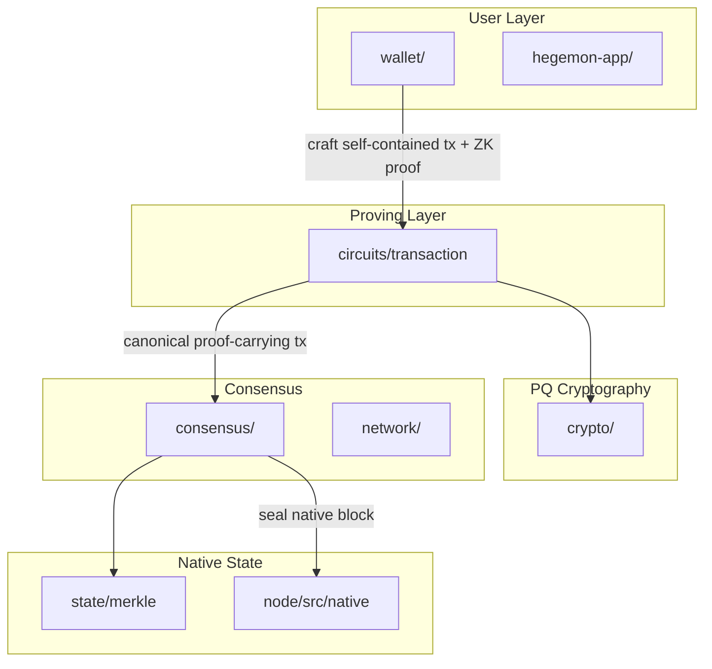
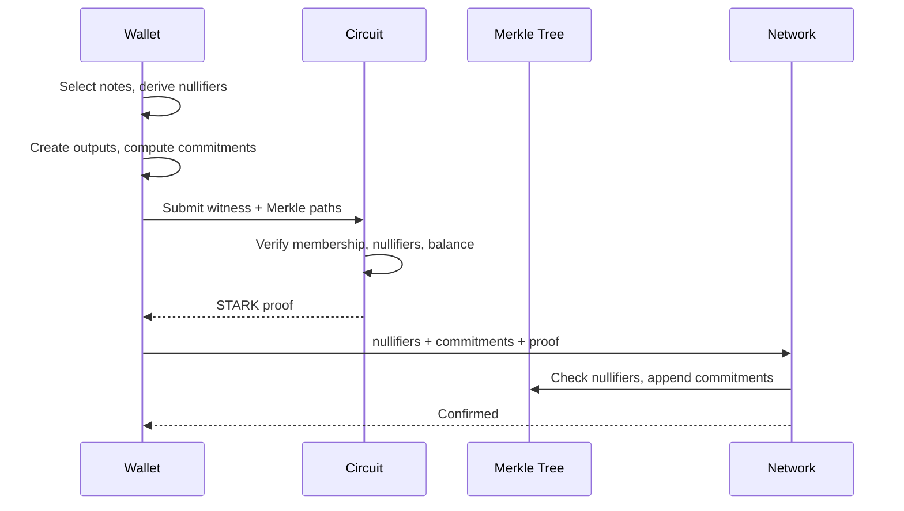

# HEGEMON - Alpha Release

Post-quantum shielded money


## Whitepaper

### Abstract
HEGEMON (HGN) is post-quantum shielded money. The project combines a shielded-only pool, manifest-driven protocol evolution, and permissionless PoW consensus into a self-custodied monetary protocol built to preserve private digital cash under quantum-capable adversaries. This whitepaper summarizes the core principles guiding the repo and connects them to the implementation artifacts contained in this monorepo.

### Motivation
HGN is a shielded-only monetary protocol built for a quantum-adversarial future. The motivation comes from two converging pressures. First, Shor-class adversaries threaten the privacy guarantees of systems that still rely on elliptic curves or pairings. Second, private digital cash still needs local custody, predictable issuance, and the ability to prove specific facts without exposing the rest of a user's history. HGN combines post-quantum cryptography, MASP-style circuits, and explicit protocol-release schedules to deliver that blend. Privacy is a first-order autonomy requirement because transparent ledgers expose balances, counterparties, and behavioral patterns to anyone willing to watch. Once outsiders can scrape that data, they can map relationships, infer strategy, pressure users, or deanonymize activists and businesses alike, making practical financial privacy impossible. The motivating use cases are:

1. **Digital bearer instrument** – Users custody notes locally via the `wallet/` client and transact without revealing balances, ownership, or memo data.
2. **Shielded monetary network** – Miners running the PoW `consensus/` stack secure issuance and confirm shielded value without transparent accounts or a public relationship graph.
3. **Proof of disclosure** – Proofs of disclosure and scoped disclosures let users prove a payment, balance claim, or source-of-funds fact without revealing unrelated history.

### Protocol overview
The HGN protocol consists of four tightly-coupled subsystems:

1. **Shielded pool and cryptography (`crypto/`, `circuits/`, `wallet/`)** – The pool is modeled as a sparse Merkle accumulator proven via STARKs. ML-DSA/SLH-DSA signature primitives, ML-KEM key encapsulation, and hash-based commitments (Blake3/SHA3, no Pedersen or ECC) underpin the spend authorization flow. Notes transition between states through the circuits defined in `circuits/`, and users interface with them via the wallet note-management APIs.
2. **Consensus and networking (`consensus/`, `network/`)** - A PoW protocol seals ordered shielded transactions. Every admitted shielded transaction must be a self-contained proof-carrying object: the wallet creates it, peers validate it before relay, miners include the same canonical proof bytes, and a fresh node revalidates them from the block without a block producer, sidecar, aggregate, receipt, or cache standing in for transaction validity. The production direction is the compact SmallWood engine with the repaired HGV8RP03 Poseidon2 V8 transaction relation and the SMZ9 proof profile. Fresh source-bound proofs and the positive action-11 coinbase lifecycle now pass. The route remains disabled until complete adaptive zero knowledge, composed post-quantum security, remaining implementation refinement, independent review, and hermetic release authorization all pass.
3. **State and execution (`node/src/native`, `state/`, `protocol/`)** – Mining nodes maintain native on-disk state, aggregate optional miner tips into the shielded coinbase path, replay higher-work side branches into canonical sled indexes, and expose programmable hooks for sidecar applications. The `protocol/` crate codifies transaction formats, serialization, tx-artifact envelopes, and block-artifact verification limits.
4. **Protocol release artifacts and runbooks (`governance/`, `runbooks/`)** – Version schedules define supported proof bindings, issuance parameters, and emergency upgrade paths. Operational runbooks document incident response, upgrade ceremonies, and miner-facing procedures; see [runbooks/miner_wallet_quickstart.md](runbooks/miner_wallet_quickstart.md) for the end-to-end node + wallet pairing walkthrough referenced throughout this whitepaper.


```mermaid
flowchart TB
    subgraph User["User Layer"]
        W[wallet/]
        UI[hegemon-app/]
    end

    subgraph Proving["Proving Layer"]
        CT[circuits/transaction]
    end

    subgraph Crypto["PQ Cryptography"]
        CR[crypto/]
    end

    subgraph Consensus["Consensus"]
        CON[consensus/]
        NET[network/]
    end

    subgraph State["Native State"]
        SM[state/merkle]
        NN[node/src/native]
    end

    W -->|craft self-contained tx + ZK proof| CT
    CT -->|canonical proof-carrying tx| CON
    CON -->|seal native block| NN
    CT --> CR
    CON --> SM
```

The operator `hegemon-node` binary is native. It starts a fresh chain, stores native block and shielded-state metadata in `sled`, mines development PoW blocks, syncs over the Hegemon PQ service, and preserves the existing JSON-RPC method names for walletd, Electron, and scripts. Version 0.10 launches by native profile and environment rather than legacy JSON chain-spec files; the public 0.10 testnet migration is a fresh-genesis restart with a versioned release record, while private devnets use `--dev` plus an isolated base path.

#### Transaction proofs and data availability
The production architecture is fixed: SmallWood proves a two-input, two-output Poseidon2 V8 transaction relation, and SMZ9 is its only candidate proof encoding. The repaired executable relation is `HGV8RP03`, semantic relation v2: 686 rows, 368 proof columns, 830 nonlinear identities, 19,899 through 20,473 statement-specialized linear identities, and a maximum 21,303-identity soundness union. Its canonical 852,305-byte program has SHA-512 `8477896dc765c3776fefc93bb74fb0c7668a677abdc60697b0c216bc9b4363e46a8b7cadc557dba4a1e4ccdfe572e5b2833879dd465079b12b6044a51a5612c3`; the first 48 bytes are the relation digest. It covers every one of the sixteen input/output activity masks, every authorization mode, Merkle membership, nullifiers, output commitments, balance conservation, and stablecoin state changes. Disabled stablecoin is a canonical pass-through: it binds the actual parent height and requires the before and after roots to equal the native context's current stablecoin root, while the inactive stablecoin asset, policy, magnitude, action-intent, counters, authorization, and witness fields remain zero. `HGV8TX02`, `SWP8LC02`, SMZ9, profile 6, and the 686-by-368 geometry remain unchanged because the relation digest is the semantic compatibility key. The source capability now carries a distinct seven-limb `note_genesis_root` and requires the canonical empty depth-32 Poseidon2 root for a fresh activation; production capability nevertheless remains absent until every evidence gate passes.

Hegemon has no transparent value pool, so production V8 requires both the sign and magnitude of `value_balance` to be canonical zero. `HGV8RP03` enforces that inside the relation, and native projection rejects nonzero values again before verification. The source capability's seven-limb `note_genesis_root` is the canonical empty depth-32 Poseidon2 root for a fresh launch; a root alone cannot bootstrap a nonempty append frontier. The selected positive-value source is the miner-local V8 coinbase action `11`. It carries an exact public opening and encrypted Eta note whose seven-limb commitment is recomputed with the same HGV8RP03 note hash, is accepted only as the final block action after V8 activation, and is rejected from RPC, peer relay, and the mempool. The retained spend fixture uses two exact positive action-11 notes at canonical positions zero and one. This path and its live lifecycle remain capability-gated and are not yet production authorized.

An SMZ9 transaction carries one canonical proof. The same bytes must survive wallet construction, RPC submission, relay, mempool admission, mining, block storage, synchronization, restart, reorganization, and fresh-node replay. The verifier rejects all earlier SMZ8, HGF6, and diagnostic proof formats. Aggregates, receipts, caches, and sidecars are never substitutes for the transaction proof.

The maximum-shape projection is 122,863 proof bytes, 128,293 RPC-envelope bytes, 128,297 SCALE inline-argument bytes, and 128,522 bytes for the complete canonical `PendingAction`, including its 225-byte outer record. The inline form is below its 131,072-byte cap by 2,775 bytes, while the complete record has its separate 131,297-byte cap. Two fresh HGV8RP03 artifact-report-v5 proofs spend the same exact two action-11 coinbase notes at positions zero and one. The primary proof is 122,735 bytes and its complete record is 128,394 bytes; the independent proof is 122,607 bytes and its complete record is 128,266 bytes. They share the exact 960-byte public statement, 852,305-byte relation program, ciphertext fixture, relation binding, network, and transcript preamble while their proof hashes, 32-byte salts, and 64-byte transcript roots differ. Both reports bind the independently reconstructed 830-file, 22,338,428-byte source inventory root `84002dce5de2e03a63ba275d8a7da08ba58804449ad531073b13731aa3ffe25cdedfa116c70ce484b4e062a73b0fb6e6608f53ccf46eb76cb29fe945786b5d8e`. The retained manifest admits exactly 29 payload files, pins both byte-identical generator binaries and the cross-proof chain report, extracts the same proof bytes from every canonical carrier, and invokes both cryptographic verifiers on both proofs. The feature-gated retained test now uses the actual wallet request builder and native RPC admission, the peer decoder and relayed-mempool API, real mining and block persistence, competing-branch reorganization, restart, and fresh announced-block import with unchanged action and proof bytes. It does not open HTTP or peer sockets and does not exercise the locator/body-chunk synchronization transport, so those external transport boundaries remain separate release tests. This closes the in-process retained lifecycle receipt, not production authorization: adaptive and global security, current-source artifact resealing, independent review, and hermetic release authority still remain, so the capability and successor registry stay empty. The 64 MiB byte-only screen fits 522 projected-maximum complete records with 20,380 bytes left before other block data, but the shared runtime ceiling is 512 V8 actions. Those counts are throughput limits, not a security-history bound; actual multi-action throughput also requires canonical root-chain validation and duplicate-nullifier rejection.

The frozen source-derived composition report is 134,914 bytes with SHA-512 `a87a7c6b3ae4f15352c21b51487b82912578aad07dbbc02bf419556462dcb83b1f441132fb2048a928b6ffe173963b905181d80486010748fad7b767419932b8`; it records `production_eligible=false`. For an explicitly reviewed total `T` of all observed or generated honest proof views, including rejected, orphaned, offline, side-fork, and repeated views, the report charges SHA-512 exposure `Q + 2^24*T`, Poseidon2 exposure `Q + 128*T`, and the exact SHA exponent `e_q(T) = bit_length(2^q + 2^24*T)`. The canonical accepted-proof count `M = 2,097,152` is arithmetic-only and is never substituted for `T`. The source verifier adapter is HGV8RP03-program-derived for every canonical statement and all 64 packed nonlinear lanes. The transaction compiler is complete only to this source-semantics boundary: verified Rust extraction and an in-Lean RFC 7693 BLAKE2b-384 implementation remain open. Activation also requires the remaining privacy and QROM premises, concrete SHA-512 and Poseidon2 reductions, independent review, and a source-bound hermetic release manifest. Until every gate passes, the capability is `None` and consensus rejects the route.

The retained-v5 proofs and carriers preserve their historical bytes, but their
frozen source inventory predates the v3 security implementation and is not
current-source release evidence. No retained manifest was silently repinned.

#### Consensus, block proofs, and state management
`DESIGN.md §6`, `METHODS.md §5`, and `.agent/SMALLWOOD_POSEIDON2_PRODUCTION_EXECPLAN.md` describe how the SmallWood transaction proof, `state/merkle`, and protocol-kernel surfaces evolve together. Every transaction carries its own canonical SMZ9 proof. Mined, announced, replayed, and synchronized blocks must use the same V8 policy gate before proof decoding. The gate remains fail-closed until the exact relation, zero-knowledge and post-quantum security arguments, verifier refinement, retained proofs, lifecycle tests, and release manifest all pass.

Protocol releases roll new bindings through the off-chain release-coordination flow documented in `governance/VERSIONING.md`: authors publish a `VersionProposal`, operators stage verifying keys and commitment-proof parameters, and each adopted release line ships the resulting `VersionSchedule` inside the canonical protocol manifest. Proposals can include `UpgradeDirective`s that mandate a dedicated migration circuit, and both the base binding and upgrade circuit appear in the block’s `version_commitment` so operators can measure uptake via the per-block version counts. The consensus crate enforces these policies by matching each observed binding against the live schedule, surfacing errors for unsanctioned bindings, and honoring retirement heights so deprecated circuits fall out automatically.

Operational touchpoints anchor the theory to daily practice. The measured v4 SMZ9 artifacts are height-zero-only, synthetic-anchor rehearsal evidence. The relation now preserves the disabled-mode parent height and stablecoin root, and the native source capability now binds the canonical empty note-tree genesis root. The two fresh source-inventory-binding v5 proofs are retained under the HGV8RP03 source root, pass exact carrier readback and cryptographic verification, and complete the real in-process positive-value restart, reorganization, and fresh announced-block-import lifecycle. HTTP, peer-socket, and locator/body-chunk synchronization remain external transport tests. During an emergency swap, `runbooks/emergency_version_swap.md` walks operators through the version proposal and retirement process. Earlier SmallWood encodings and all standalone Binius, M4, and Flock profiles are historical or research-only. Moving proof bytes to a miner cache, aggregate, receipt, or sidecar does not satisfy the self-contained validity rule.

#### Shielded transactions and PQ cryptography


```mermaid
sequenceDiagram
    participant W as Wallet
    participant C as Circuit
    participant M as Merkle Tree
    participant N as Network

    W->>W: Select notes, derive nullifiers
    W->>W: Create outputs, compute commitments
    W->>C: Submit witness + Merkle paths
    C->>C: Verify membership, nullifiers, balance
    C-->>W: STARK proof
    W->>N: nullifiers + commitments + proof
    N->>M: Check nullifiers, append commitments
    N-->>W: Confirmed
```

Each note in the MASP-style pool carries `(value, asset_id, pk_recipient, pk_auth, rho, r)` as described in `METHODS.md §1`, and the wallet logic in `wallet/` maintains those fields while deriving commitments via `cm = Hc("note" || enc(value) || asset_id || pk_recipient || rho || r || pk_auth)` before inserting them into the STARK-proven Merkle forest in `state/`. Real asset identifiers must be canonical Goldilocks field representatives and cannot use the balance-slot padding sentinel or its reduced field alias. For private predicate threshold notes, the hidden `pk_auth` slot is a policy commitment key derived from the private `policy_root`, threshold, and policy commitment randomness; no signer set, m/n value, approval count, approval nullifier, or action-layer authorization field is published. The `circuits/transaction` crate enforces that every published commitment matches an in-circuit re-computation, while the note handling API exposes the corresponding secrets so a sender can prove knowledge without leaking them on-chain.

Spend authorization follows the hash-based nullifier scheme from `METHODS.md §1.2` and `DESIGN.md §1`. The V8 relation recomputes its nullifiers, note commitments, Merkle path, and authorization commitments with the fixed width-16 Poseidon2 parameter set. It supports single-key spends, approval steps, and final threshold spends, including the exact two-input restrictions of the latter modes. Earlier wallet hash paths remain compatibility code and cannot authorize V8. Exact implementation refinement, proof-system soundness, and complete zero knowledge remain release blockers.

Multi-asset conservation follows `METHODS.md §2`: V8 constrains the signed input/output balance, fees, issuance, asset identifiers, and stablecoin transition inside the same 120-word public statement. Seven field limbs bind each externally visible digest or intent value without truncation. Native admission must obtain the expected pre-state from authenticated consensus state, verify the proof against that exact statement, and commit the resulting nullifier and output changes atomically. Native and formal refinement must pass before this balance claim can authorize production.

Post-quantum security hinges on the primitives cataloged in `DESIGN.md §1`: ML-DSA handles miner and protocol-authenticated envelope signatures, SLH-DSA anchors long-lived trust roots, and ML-KEM drives note/viewing key encryption, all exposed via the unified `crypto/` crate. The STARK and note-authorization paths avoid elliptic-curve, pairing, and factoring assumptions exposed to Shor’s algorithm. Their deployed soundness still depends on the explicitly recorded hash/QROM, semantic-refinement, and compiled-verifier assumptions; the repository does not relabel an interactive error estimate as an end-to-end post-quantum guarantee.

Wallet note ciphertexts now have a theorem- and vector-checked chain-to-DA boundary: chain bytes remove only the canonical compact ML-KEM length field to form the DA hash preimage, and production parsers must reparse that projected DA form with the same public summary before `ciphertext_hash_bytes` is used.

PoW seals and node-authenticated envelopes use the same PQ signing surface: ML-DSA-backed miner identities with hash-derived 32-byte ids. This keeps address encoding stable while aligning wallet and miner verification around lattice and hash-based primitives.

These intended guarantees are tracked in code and formal artifacts rather than inferred from prose: `circuits/formal` captures nullifier-uniqueness and MASP-balance models, while retained SmallWood research benchmarks and `wallet-bench` expose performance evidence. None of those legacy benchmarks is a measured proof for a fresh successor relation or a production-security certificate.

#### Assessing resistance to Shor’s algorithm
HGN deliberately removes every discrete-log or factoring dependency that Shor’s algorithm could exploit. The `crypto/` crate standardizes on lattice- and hash-based primitives—ML-DSA for authenticated envelopes, SLH-DSA for long-lived trust roots, and ML-KEM for note encryption—so the intended transaction path has no RSA, elliptic-curve, or pairing target. V8 uses Poseidon2 only as an algebraic hash inside the transaction relation and SHA-512 for the SmallWood transcript. Neither is a Shor target, but that fact alone does not establish transaction-proof security. The compiled relation refinement, whole-proof zero-knowledge simulator, proof-system composition, finite quantum-random-oracle bound, lifetime query accounting, and implementation refinement remain release requirements.

#### Privacy architecture and upgrade continuity
The privacy layer is engineered as a single, MASP-style shielded pool from genesis with no transparent escape hatches: commitments, nullifiers, balance conservation, and diversified address derivation all stay inside transparent STARK proofs built on hash- and lattice-only primitives (ML-DSA/SLH-DSA signatures, ML-KEM note encryption, and hash-based commitments). Selective disclosure relies on incoming/outgoing/full viewing keys rather than transparent outputs, preserving address privacy while enabling audits. The protocol removes discrete-log assumptions and trusted setups entirely, accepting larger proof payloads to gain post-quantum resilience. Versioned circuits and commitment proofs keep the shielded pool intact during upgrades so the privacy set stays unified as the protocol evolves.

**Quantitative privacy assessment (in bits):**

| Property | Classical Security | Post-Quantum Security | Notes |
|----------|-------------------|----------------------|-------|
| **Note encryption (ML-KEM-1024)** | 256 bits | ~128 bits | NIST Level 5; protects sender→recipient payloads |
| **V8 Poseidon2 commitment binding** | Parameter-dependent primitive estimate | About 149-bit generic quantum collision work | Primitive estimate only; the composed proof bound is tracked separately |
| **V8 Poseidon2 nullifier preimage resistance** | Parameter-dependent primitive estimate | At least the selected 128-bit target under the recorded parameter assumptions | Requires the same independent parameter review and composed proof analysis |
| **Transaction proof soundness** | Conditional model result | Conditional model result | The frozen composition accounts for `Q + 2^24*T` SHA-512 exposure and `Q + 128*T` Poseidon2 exposure, with `e_q(T) = bit_length(2^q + 2^24*T)`. `T` must be an explicit reviewed bound on every observed or generated honest proof view; the accepted canonical count is not a substitute. Concrete reductions and the remaining refinement, privacy, history, and review premises still block production. |
| **Signatures (ML-DSA-65)** | ~192 bits | ~128 bits | NIST Level 3; used for block/tx authentication |
| **V8 Merkle path binding** | Parameter-dependent primitive estimate | At least the selected 128-bit target under the recorded parameter assumptions | Depth 32; exact relation and reduction terms must pass release review |

**Anonymity set**: All notes share a single shielded pool—the anonymity set equals the total note count (currently 2³²–2⁴⁰ capacity). Version upgrades do not partition users into separate privacy pools.

**Information leakage**: Transaction timing and proof size are observable; sender, recipient, amounts, and asset types remain hidden. Viewing keys and proofs of disclosure enable targeted disclosure without breaking pool-wide privacy.

The SmallWood parameter result, production status, and attack record are kept
separate. The active SMZ9 calculation uses the exact 686-row, 368-column,
degree-eight HGV8RP03 relation with rho five, six PIOP openings, beta two, a
`2^23` DECS domain, twenty DECS openings, twenty independent 64-byte tapes,
and eta five. Its source maximum is 122,863 proof bytes. The two retained v5
proofs measure 122,735 and 122,607 bytes and remain unchanged. The retained
manifest and positive in-process wallet-to-fresh-import lifecycle establish
canonical-byte preservation and source-verifier replay, not production
authority or live-network transport coverage.

The frozen source-security report is 134,914 bytes with SHA-512
`a87a7c6b3ae4f15352c21b51487b82912578aad07dbbc02bf419556462dcb83b1f441132fb2048a928b6ffe173963b905181d80486010748fad7b767419932b8`.
It charges SHA-512 exposure `Q + 2^24*T`, Poseidon2 exposure `Q + 128*T`, and
uses the exact exponent `e_q(T) = bit_length(2^q + 2^24*T)`. Here `T` means
every observed or generated honest proof view, including rejected, orphaned,
offline, side-fork, and repeated views. The canonical accepted count
`M = 2,097,152`, the 512-action runtime cap, and the 64 MiB byte screen are
arithmetic or throughput controls only and can never replace a reviewed `T`.

The frozen executable privacy report is 4,230 bytes with SHA-512
`0efabeb6d53f2557b12f21747fecbcc4694a3ed44a78075804908a6c6b0a028d4b84c7b85a2c33bf62f6248dd0b3ef123953c7f89d31ab386d30b0bfe34a73c8`.
It uses a typed coin tape drawn through `CryptoRng` with exact rejection and
consumption accounting, exact
programmable SHA-512 replay, and no salt-only oracle program. Its exact lazy
strict-128 ceiling is `18,889,465,930,379,069,227,007` observed views. The
remaining constructor-free premises are refinement from the RNG to independent
uniform coins, applicability of the adaptive hidden-subtree argument in the
QROM, concrete SHA-512 random-oracle and global composition, and an enforceable
bound on `T`. The algebraic simulator distance is zero under those premises;
the adaptive programming loss is accounted separately.

The source-derived lazy upper bound uses the exact executable constraints
`leaf <= 20` and `leaf + internal <= 372`. It therefore charges caps of 21
leaf-plus-final 512-bit events and 352 internal 1024-bit events per view. This
is a sound loss-maximizing envelope, not a claim that one path attains both
caps simultaneously.

The compiler and conformance work is complete only to the source-semantics
boundary: all sixteen masks and authorization modes are covered, but verified
Rust extraction and an in-Lean RFC 7693 BLAKE2b-384 implementation remain.
An inactive, unselected q20/56 `SMC8` size candidate measured 119,767 inner
proof bytes and 125,201 bytes for a two-output action, with source ceilings of
119,879 and 125,313 bytes. It saves 2,984 bytes at the source worst case while
retaining q20 conditional arithmetic, but has no retained artifact, transport
route, manifest, or authorization change. Both reports record production false,
the capability remains `None`, and consensus continues to reject actions 10 and
11 until every external premise, refinement, review, and release gate passes.

### Monetary model
HGN's core monetary posture is simple: shielded bearer money, predictable issuance, and local custody. Supply is enforced inside the protocol's value-balance rules; block subsidies follow the time-normalized halving schedule described in `TOKENOMICS_CALCULATION.md`, fees can be burned, and all rewards land directly inside the shielded pool rather than a transparent account class.

Three properties matter operationally:

- **Predictable issuance** – the emission curve is explicit in protocol constants instead of discretionary intervention.
- **Shielded rewards** – miner and any protocol-level allocations are created as shielded outputs, preserving a single anonymity set from issuance onward.
- **Portable ownership** – users hold notes directly via `wallet/`, and the chain only sees commitments, nullifiers, and proofs.

Protocol manifests and version schedules still coordinate supported bindings and emergency upgrades, but their job is continuity of the privacy pool, not macroeconomic steering. The release machinery exists to preserve compatibility, ship cryptographic repairs, and keep one canonical shielded pool alive across upgrades.

### Privacy, security, and proof of disclosure
The architecture prioritizes defense-in-depth:

- **Post-quantum primitive posture** – Signatures and key exchanges default to PQ-safe primitives maintained in `crypto/`; transaction-proof soundness remains conditional on the explicit formal boundaries above.
- **Soundness and correctness** – Every critical path change must update `DESIGN.md`, `METHODS.md`, and any relevant specification artifacts to keep the implementation auditable.
- **Proof of disclosure** – Proofs of disclosure and scoped viewing keys let users prove specific facts to counterparties or other verifiers without surrendering the rest of their history.

#### Security and assurance program
[docs/THREAT_MODEL.md](docs/THREAT_MODEL.md) documents the baseline adversary: Shor-capable attackers can compromise classical public-key systems, replay malformed traffic, and attempt to bias randomness. This is why the intended transaction path uses ML-DSA/SLH-DSA signatures, ML-KEM key exchange, conventional wide symmetric hashes, and a future fresh typed semantic-digest profile, why the proof system avoids trusted setups, and why adaptive-compromise controls must survive even when an attacker briefly controls wallets or consensus nodes. No transaction-proof security composition currently closes, so these primitive choices are requirements rather than a release claim.

[DESIGN.md §8](DESIGN.md#8-security-assurance-program) outlines the feedback loops that keep those assumptions observable. External cryptanalysis and third-party audits—tracked in [docs/SECURITY_REVIEWS.md](docs/SECURITY_REVIEWS.md)—tie concrete findings back to functions and commits so the PQ parameter set never drifts silently. The TLA+ models under `circuits/formal/` and `consensus/spec/formal/` make witness layouts, balance invariants, and consensus safety reviewable at every release gate, giving reviewers a mechanical view of each subsystem's state. Continuous integration runs the `security-adversarial` workflow plus dedicated fuzz/property tests for transactions, network handshakes, wallet address derivations, and the root-level `tests/security_pipeline.rs`, so regressions surface as blocking signals with attached artifacts. Together, audits, formal specs, and CI logs ensure every subsystem—from proofs to networking—emits evidence that the live system still matches the whitepaper.

Operators follow [runbooks/security_testing.md](runbooks/security_testing.md) whenever the adversarial suite fails, before releases, or after touching witnesses, networking, or wallet encodings. The runbook pins `PROPTEST_CASES`, executes the four adversarial `cargo test` commands (transaction circuit fuzzing, network handshake mutations, wallet address fuzzing, and the cross-component pipeline), and, when necessary, re-runs the TLA+/Apalache jobs for circuit balance and consensus safety. Findings, seeds, and transcripts are captured and logged into [docs/SECURITY_REVIEWS.md](docs/SECURITY_REVIEWS.md), which enforces that mitigation PRs add regression tests plus design updates. This workflow closes the loop between operator playbooks and the canonical review ledger so the assurance process remains enforceable rather than aspirational.

### Roadmap
1. **Alpha** – Keep shielded-transfer routing fail-closed while completing the four host-only manifest/consensus authority predicates, executing scalar-to-M4 parity, compiling the exact relation into an odd-field complete-ZK challenger, selecting or rejecting that architecture against composed-PQ128 gates, and measuring only a qualifying maximum-shape proof, alongside wallet performance work.
2. **Beta** – Harden the PoW consensus path, finalize protocol-manifest operations, and document how external miners can sync, mine, and upgrade safely.
3. **Launch** – Freeze the core issuance schedule and proof surfaces, publish third-party audits, and release reproducible builds for wallet and mining node binaries.

---

## Monorepo layout

| Path | Purpose |
| --- | --- |
| `circuits/` | Transaction and block proof code, including the SmallWood Poseidon2 V8 candidate and retained rejected research benchmarks. |
| `consensus/` | Ledger/miner logic and the Go `netbench` throughput simulator under `consensus/bench`. |
| `crypto/` | Rust crate (`synthetic-crypto`) with ML-DSA/SLH-DSA signatures, ML-KEM, and hash/commitment utilities. |

| `docs/` | Contributor docs (`CONTRIBUTING.md`), threat model, and API references that stay in sync with `DESIGN.md`/`METHODS.md`. |
| `governance/` | Protocol versioning and release-coordination documentation. |
| `hegemon-app/` | Electron desktop app for node + wallet control. |
| network/ | P2P networking stack and connectivity logic. |
| node/ | Native node binary (`hegemon-node`) and sled/PQ networking service code. |
| protocol/ | Protocol definitions, transaction formats, and versioning logic. |
| `runbooks/` | Operational guides for miners, emergency procedures, and security testing. |
| `scripts/` | Shell scripts for dev setup and automation. |
| `state/` | Merkle tree storage and state management. |
| `tests/` | Integration tests and the security pipeline suite. |
| `wallet/` | CLI wallet plus the `wallet-bench` binary for note/key performance measurements. |

## Getting started

### Building the Native Node

1. **Install toolchains**:
   ```bash
   make setup
   ```
   This runs `scripts/dev-setup.sh` to install Rust, Go, and other dependencies.

2. **Build the node**:
   ```bash
   make node
   ```

3. **Run a development node with mining**:
   ```bash
   HEGEMON_MINE=1 ./target/release/hegemon-node --dev --tmp
   ```
   The node starts with a temporary database, mining enabled, and RPC on port 9944.

4. **Query the node via RPC**:
   ```bash
   curl -s -H "Content-Type: application/json" \
     -d '{"id":1, "jsonrpc":"2.0", "method": "hegemon_consensusStatus"}' \
     http://127.0.0.1:9944
   ```

For multi-node setups, see [runbooks/two_node_remote_setup.md](runbooks/two_node_remote_setup.md). For VPS deployments, follow [runbooks/p2p_node_vps.md](runbooks/p2p_node_vps.md).

### Building the Desktop App

The desktop app uses bundled release binaries and talks only to localhost RPC. Renderer code reaches privileged desktop actions, including clipboard writes, through the typed Electron preload bridge. For a local ad-hoc bundle:

```bash
cargo build --release -p hegemon-node -p walletd
npm --prefix hegemon-app run package
```

For a production macOS release, use the fail-closed notarization path:

```bash
APPLE_ID="<apple-id>" \
APPLE_APP_SPECIFIC_PASSWORD="<app-password>" \
APPLE_TEAM_ID="<team-id>" \
npm --prefix hegemon-app run dist:prod
```

API-key notarization is also supported with `APPLE_API_KEY`, `APPLE_API_KEY_ID`, and `APPLE_API_ISSUER`. Without one complete credential set, `dist:prod` exits before packaging.

### Node CLI Options

```bash
./target/release/hegemon-node --help
```

Key options:
- `--dev` - Run in development mode with relaxed local settings and a fresh ephemeral chain
- `--tmp` - Use a temporary database (cleaned on exit)
- `--base-path <PATH>` - Persistent database location
- `--rpc-port <PORT>` - JSON-RPC port (default: 9944)
- `--port <PORT>` - P2P port (default: 30333)
- `HEGEMON_SEEDS=<host:port,...>` - Bootstrap peers for native P2P sync. Shared miners must use the same approved seed list, currently `HEGEMON_SEEDS="hegemon.pauli.group:30333,devnet.hegemonprotocol.com:30333"`, to avoid forks.

Environment variables:
- `HEGEMON_MINE=1` - Enable mining
- `HEGEMON_MINE_THREADS=N` - Mining thread count
- `HEGEMON_MINER_ADDRESS=<shielded_addr>` - Shielded address for coinbase rewards

### Two-node testnet pairing

Use this when you want to run two nodes that peer with each other:

1. **Build the binary**:
   ```bash
   make node
   ```

2. **Start the first node (mining)**:
   ```bash
   HEGEMON_MINE=1 ./target/release/hegemon-node --dev \
     --base-path /tmp/node1 \
     --port 30333 \
     --rpc-port 9944
   ```

3. **Start the second node (peering with first)**:
   ```bash
   HEGEMON_SEEDS="127.0.0.1:30333" ./target/release/hegemon-node --dev \
     --base-path /tmp/node2 \
     --port 30334 \
     --rpc-port 9945 \
     --listen-addr 127.0.0.1:30334
   ```

4. **Verify connectivity**:
   ```bash
   # Check consensus sync state. system_peers, hegemon_peerList, and
   # hegemon_peerGraph are unsafe-only topology RPCs.
   curl -s -H "Content-Type: application/json" \
     -d '{"id":1, "jsonrpc":"2.0", "method": "hegemon_consensusStatus"}' \
     http://127.0.0.1:9944
   # Expected: syncing=false and an advancing height after the second node joins.
   ```

### Developer Setup

- **Toolchains** – Run `./scripts/dev-setup.sh` (or `make setup`) to install Rust/Go/jq/clang-format.
- **Tests** – `make check` mirrors the fmt/lint/test CI combo.
- **Benchmarks** – `make bench` exercises prover, wallet, and network smoke benches.

### Helpful `make` targets

| Target | Purpose |
| --- | --- |
| `make setup` | Runs `scripts/dev-setup.sh` to install toolchains and CLI prerequisites. |
| `make node` | Builds the native `hegemon-node` binary. |
| `make check` | Formats, lints, and tests the entire Rust workspace. |
| `make bench` | Executes the prover, wallet, and network smoke benchmarks. |
| `make wallet-demo` | Generates example wallet artifacts plus a balance report inside `wallet-demo-artifacts/`. |

---

## Future directions: programmability

Hegemon currently prioritizes privacy and post-quantum security over general-purpose programmability. There is no EVM or user-deployed WASM contract layer today; all logic lives in fixed native protocol modules. This section outlines how user-deployed code could be introduced while preserving the shielded pool's privacy guarantees.

### Current scriptability boundary

Today the chain exposes:

- fixed native protocol modules rather than user-deployed contracts
- a shielded-only value layer rather than a mixed public/private account model
- protocol upgrades through `VersionBinding` / `VersionSchedule`, not arbitrary runtime uploads

That keeps the current product narrow: post-quantum shielded money first, programmability later.

### Candidate approaches

**Option A: Predicate Notes** — Notes carry hidden policy material through the existing private authorization commitment slot, and the STARK circuit proves predicate satisfaction. A small DSL covers common cases (timelocks, M-of-N multisig, hash preimages). For private multisig, value is first relocked to a hidden key derived from the private policy root and exact spend intent, then approvals advance a shielded accumulator note for that same intent; the final spender consumes only the value-locked note plus threshold-satisfied accumulator note and never receives signer long-term secrets. The hidden authorization key binds the private policy, threshold, and final spend intent into the consumed notes, so witness-selected predicate data cannot drift after note creation. Privacy is preserved because the predicate, signer set, threshold, approval leaves, approval count, policy root, and approval nullifiers stay off-chain.

**Option B: zkVM Execution Traces** — Users deploy WASM or RISC-V programs whose execution traces are proven in a recursive STARK. The chain sees only `code_hash`, nullifiers consumed, and new commitments—never the program logic or inputs. This keeps execution private while staying on transparent proofs and PQ-safe primitives.

**Option C: Private State Channels** — Keep L1 simple; push complex logic to off-chain channels with ML-DSA-signed state updates. Disputes submit STARK proofs of protocol violations. This scales well but requires liveness from channel participants.

### Compatibility with existing upgrade machinery

All three options integrate with Hegemon's `VersionBinding` and `VersionSchedule` infrastructure:

```
VersionBinding { circuit: 1, crypto: 1 }  // Current: simple spend
VersionBinding { circuit: 2, crypto: 1 }  // Future: + predicate interpreter
VersionBinding { circuit: 3, crypto: 1 }  // Future: + zkVM trace verifier
```

New circuit versions are proposed via `VersionProposal`, activated at scheduled heights, and can coexist with older versions indefinitely. Notes created today could be spent with a future predicate circuit without migration—the pool stays unified.

### Open research questions

1. **Private state**: How do contracts maintain encrypted state across transactions? Options include encrypted blobs in note memos or dedicated "state notes" consumed and recreated each transaction.
2. **Composability**: Can shielded contracts call each other atomically? Requires proving multiple execution traces in one STARK or cross-contract commitment schemes.
3. **Prover delegation**: Heavy proofs may require delegated provers, introducing privacy/trust tradeoffs. TEE-assisted proving or prover markets are possible mitigations.

This design space—PQ + STARK + privacy + programmability—remains largely unexplored. Hegemon's architecture is positioned to experiment with these extensions without fragmenting the privacy pool.
