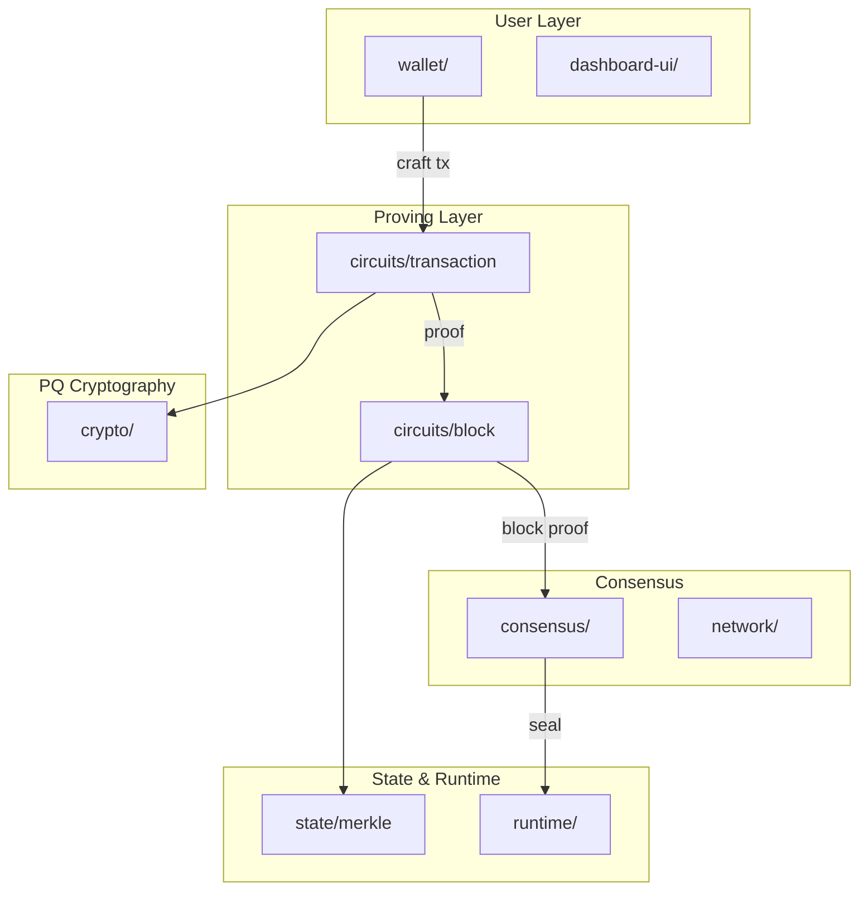
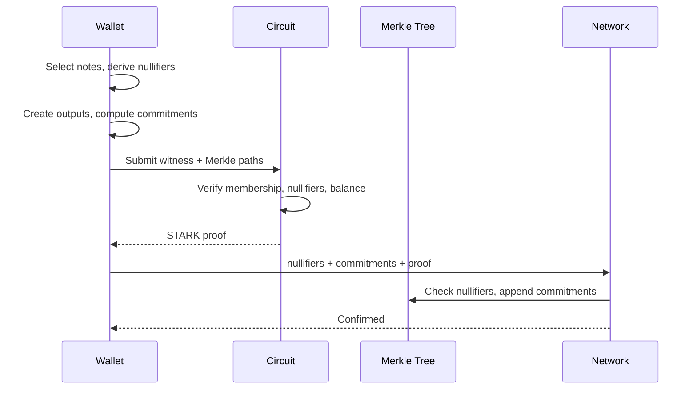

# HEGEMON - Alpha Release

Quantum-resistant private payments


## Whitepaper

### Abstract
HEGEMON (HGN) establishes a unified, privacy-preserving settlement layer that remains secure even in the presence of large-scale quantum adversaries. The project combines a post-quantum shielded pool, programmable governance, and settlement-grade consensus into a single monetary primitive that can serve both retail and interbank use cases. This whitepaper summarizes the core principles guiding the repo and connects them to the implementation artifacts contained in this monorepo.

### Motivation
HGN is a post-quantum, Zcash-inspired settlement layer focused entirely on shielded transactions. The motivation comes from two converging pressures. First, Shor/Grover-class adversaries threaten to rewind the privacy guarantees of legacy shielded pools that still rely on elliptic curves or pairings. Second, the most commercially interesting private-payment applications still need instant settlement, programmability, and selective disclosure without surrendering supply controls. HGN combines PQ cryptography, MASP-style circuits, and governance hooks to deliver that blend. Privacy is a first-order commercial requirement because merchants, suppliers, and consumers routinely expose strategic information—such as inventory positions, negotiated discounts, or sensitive purchase histories—when forced to transact on transparent ledgers. Once adversaries or competitors can scrape that data, they can front-run contracts, profile customers for coercive price discrimination, or deanonymize activists, making private commerce practically impossible. The motivating use cases are:

1. **Digital bearer instrument** – Users custody notes locally via the `wallet/` client and transact without revealing balances, ownership, or memo data.
2. **Cross-border settlement rail** – Miners running the PoW `consensus/` stack deliver eventual finality for interbank transfers and bridge interfaces while preserving the privacy pool semantics.
3. **Programmable safety net** – Governance modules under `governance/` can enact capped issuance, capital controls, or demurrage in response to macro shocks, while remaining auditable.

### Protocol overview
The HGN protocol consists of four tightly-coupled subsystems:

1. **Shielded pool and cryptography (`crypto/`, `circuits/`, `wallet/`)** – The pool is modeled as a sparse Merkle accumulator proven via STARKs. ML-DSA/SLH-DSA signature primitives, ML-KEM key encapsulation, and hash-based commitments (Blake3/SHA3, no Pedersen or ECC) underpin the spend authorization flow. Notes transition between states through the circuits defined in `circuits/`, and users interface with them via the wallet note-management APIs.
2. **Consensus and networking (`consensus/`, `network/`)** - A PoW protocol seals batches of shielded transactions. The Go `netbench` tooling simulates adversarial bandwidth conditions, while the Rust consensus service validates blocks by checking a recursive proof commitment and performing per-node randomized data-availability sampling of erasure-coded chunks.
3. **State and execution (`state/`, `protocol/`)** – Mining nodes maintain on-disk Merkle forests, apply deterministic fee burning, and expose programmable hooks for sidecar applications. The `protocol/` crate codifies transaction formats, serialization, and proof verification limits.
4. **Governance and runbooks (`governance/`, `runbooks/`)** – Multi-tier governance defines monetary policy, mining incentives, and emergency brake conditions. Operational runbooks document incident response, upgrade ceremonies, and regulator disclosures for PoW operators; see [runbooks/miner_wallet_quickstart.md](runbooks/miner_wallet_quickstart.md) for the end-to-end node + wallet pairing walkthrough referenced throughout this whitepaper.



#### Proof-carrying blocks and data availability
Blocks are intended to carry a single recursive STARK proof that verifies all transactions, nullifier uniqueness, and commitment-tree updates in one shot. The block header commits to that proof via `recursive_proof_hash` and commits to the block payload via an erasure-coded data-availability root (`da_root`) plus `da_params` that fix chunk size and sample count. Validators accept a block by (1) verifying the recursive proof once and (2) sampling a small set of chunks chosen with per-node randomness, requesting each chunk and its Merkle proof over P2P, and rejecting the block if any sample is missing or invalid. The recursion machinery lives under `circuits/epoch` and is being wired into `circuits/block` and `consensus/` as the recursive digest path is retired.

#### Consensus, block proofs, and state management
`DESIGN.md §6` and `METHODS.md §5` describe how the `state/merkle`, `circuits/block`, and `protocol-versioning` crates collaborate to keep the chain coherent as primitives evolve. Miners append transactions to the Poseidon-based forests in `state/merkle`, then call `circuits/block::prove_block` locally before broadcasting a PoW solution. Every transaction carries a `VersionBinding { circuit, crypto }`, and block producers batch those into a `VersionMatrix` whose hash becomes the header’s `version_commitment`. The `protocol-versioning` crate exposes helpers for encoding that matrix plus the `VersionBinding` counts that recursive proofs publish so the network can attest exactly which circuit/crypto combinations were accepted in a slot. On ingest, PoW nodes query `VersionSchedule::first_unsupported` before finalizing state; if a block references a binding that governance has not scheduled, consensus raises `ConsensusError::UnsupportedVersion` and refuses to advance the Merkle roots even if the hashpower majority momentarily disagrees.

The current block circuit records a `RecursiveAggregation` digest as a bridge, and the scalability plan upgrades this path to a true recursive proof whose hash (`recursive_proof_hash`) and DA root (`da_root`) live in the block header alongside `da_params`. That shift lets consensus verify a single proof per block and then rely on randomized DA sampling for payload availability instead of re-checking every transaction proof.

Governance rolls new bindings through the flow in `governance/VERSIONING.md`: authors submit a `VersionProposal`, reviewers stage verifying keys and recursive proof parameters, and once ratified the proposal is inserted into the canonical `VersionSchedule`. Proposals can include `UpgradeDirective`s that mandate a dedicated migration circuit, and both the base binding and upgrade circuit appear in the block’s `version_commitment` so operators can measure uptake via the recursive proof’s `version_counts`. The consensus crate enforces these policies by matching each observed binding against the live schedule, surfacing errors for unsanctioned bindings, and honoring retirement heights so deprecated circuits fall out automatically.

Operational touchpoints anchor the theory to daily practice. `consensus/bench` replays the ML-DSA/STARK payload sizes described in `DESIGN.md §6` so operators can benchmark PQ-era throughput before activating new bindings. During an emergency swap, `runbooks/emergency_version_swap.md` walks operators through drafting the `VersionProposal`, enabling the mandated `UpgradeDirective`, and monitoring `version_counts` until the `VersionSchedule` retires the compromised binding. Together, the recursive block proofs, version commitments, and governance hooks keep consensus, state, and operations synchronized without cloning the privacy pool.

#### Shielded transactions and PQ cryptography



Each note in the MASP-style pool carries `(value, asset_id, pk_recipient, rho, r)` as described in `METHODS.md §1`, and the wallet logic in `wallet/` maintains those fields while deriving commitments via `cm = Hc("note" || enc(value) || asset_id || pk_recipient || rho || r)` before inserting them into the STARK-proven Merkle forest in `state/`. The `circuits/transaction` crate enforces that every published commitment matches an in-circuit re-computation, while the note handling API exposes the corresponding secrets so a sender can prove knowledge without leaking them on-chain.

Spend authorization follows the hash-based nullifier scheme from `METHODS.md §1.2` and `DESIGN.md §1`: the wallet derives `sk_nf = H("view_nf" || sk_view)` and the `crypto/` primitives derive `nk = H("nk" || sk_nf)` then `nf = H("nf" || nk || rho || pos)` per note, and the STARK constraints in `circuits/transaction` bind each public nullifier to its witness data so the `state/` nullifier set catches double-spends. Proof witnesses also include Merkle paths for inputs, and the verifier logic wired through `protocol/` only accepts transactions whose STARK proofs simultaneously demonstrate membership, note opening correctness, and adherence to the MASP value equations.

Multi-asset conservation is implemented exactly as `METHODS.md §2` prescribes: the circuit forms a permutation-checked multiset of `(asset_id, signed_delta)` pairs, sorts and compresses them, and emits a `balance_tag` commitment that nodes in `consensus/` compare against fee and issuance rules. By constraining the integer ranges in-field and collapsing per-asset totals, the prover shows that every input and output balances out, and `wallet/` surfaces the same accounting so users can audit multi-asset flows locally.

Post-quantum security hinges on the primitives cataloged in `DESIGN.md §1`: ML-DSA handles miner and governance signatures, SLH-DSA anchors long-lived roots of trust, and ML-KEM drives note/viewing key encryption, all exposed via the unified `crypto/` crate. Because the STARK proving stack in `circuits/transaction` and the note authorization flow rely only on hash-based commitments and lattice primitives, the pool stays quantum-safe—no elliptic curves or pairing-based assumptions remain for Shor’s algorithm to break, and Grover merely halves the effective hash security margin already accounted for with 256-bit digests.

Runtime extrinsics and PoW seals now share the same PQ signing surface: `runtime/src/lib.rs` defines `PqSignature`/`PqPublic` backed by ML-DSA (3,293-byte signatures, 1,952-byte public keys) and SLH-DSA, derives `AccountId32` via BLAKE2 over the PQ public key for SS58-prefix-42 compatibility, and wires the off-chain AppCrypto path through the same primitives the PoW engine validates. This keeps address encoding stable while aligning transaction signing with the miner verification path.

These guarantees are not just prose: `circuits/formal` captures the nullifier uniqueness and MASP balance invariants in TLA+, and `circuits-bench` plus the `wallet-bench` suite publish the prover and client performance envelopes so reviewers can correlate the whitepaper claims with reproducible benchmarking and formal artifacts.

#### Assessing resistance to Shor’s algorithm
HGN deliberately removes every discrete-log or factoring dependency that Shor’s algorithm could exploit. The `crypto/` crate standardizes on lattice- and hash-based primitives—ML-DSA (Dilithium-like) for miner/governance signatures, SLH-DSA (SPHINCS+) for long-lived trust roots, and ML-KEM (Kyber-like) for encrypting note/viewing keys—so there are no RSA or elliptic-curve targets to collapse. Hash commitments rely on BLAKE3-256 by default (with SHA3-256 and Poseidon-style permutations for STARK domains), meaning Grover’s quadratic speedup is already absorbed into the security margin. The STARK proving system is fully transparent and anchored in hash collision resistance, so its soundness does not rely on pairings or number-theoretic assumptions either. Finally, the threat model assumes adversaries already possess Shor/Grover-class hardware, which is why consensus governance bans downgrades to classical primitives and enforces PQ-safe key sizes. Together, these design choices provide a high degree of resistance to Shor’s algorithm across the entire stack—from note commitments and proofs to networking, governance, and operational guardrails.

#### Privacy architecture and comparison to Zcash
The privacy layer is engineered as a single, MASP-style shielded pool from genesis with no transparent escape hatches: commitments, nullifiers, balance conservation, and diversified address derivation all stay inside transparent STARK proofs built on hash- and lattice-only primitives (ML-DSA/SLH-DSA signatures, ML-KEM note encryption, and hash-based commitments). Selective disclosure relies on incoming/outgoing/full viewing keys rather than transparent outputs, preserving address privacy while enabling audits. In contrast to Zcash’s elliptic-curve commitments and trusted-setup SNARKs (Sapling/Orchard), HGN eliminates discrete-log assumptions and trusted setups entirely, accepting larger proof payloads to gain post-quantum resilience. Zcash’s history of launching new pools (Sprout → Sapling → Orchard) is replaced here by versioned circuits and recursive proofs that keep the shielded pool intact during upgrades, ensuring quantum-era safety without fragmenting privacy sets.

**Quantitative privacy assessment (in bits):**

| Property | Classical Security | Post-Quantum Security | Notes |
|----------|-------------------|----------------------|-------|
| **Note encryption (ML-KEM-768)** | 192 bits | ~96 bits | NIST Level 3; protects sender→recipient payloads |
| **Commitment hiding (Blake3-256)** | 256 bits | ~128 bits | Grover halves effective security |
| **Nullifier preimage resistance** | 256 bits | ~128 bits | Hash-based; no algebraic shortcuts |
| **STARK proof soundness** | ~96 bits | ~96 bits | 32 queries × log₂(8) blowup; hash-based, Grover-resistant |
| **Signatures (ML-DSA-65)** | ~192 bits | ~128 bits | NIST Level 3; used for block/tx authentication |
| **Merkle path binding** | 256 bits | ~128 bits | Poseidon over Goldilocks; 32–40 depth tree |

**Anonymity set**: All notes share a single shielded pool—the anonymity set equals the total note count (currently 2³²–2⁴⁰ capacity). Unlike Zcash's fragmented pools (Sprout/Sapling/Orchard), version upgrades do not partition users.

**Information leakage**: Transaction timing and proof size are observable; sender, recipient, amounts, and asset types remain hidden. Viewing keys enable selective disclosure without breaking pool-wide privacy.

### Monetary model
HGN targets a basket-pegged unit of account. Key levers include:

- **Supply management** – Mining nodes enforce capped issuance defined in `DESIGN.md`, and surplus fees route to a stabilization reserve to dampen volatility.
- **Liquidity incentives** – Wallet and miner clients expose hooks for automated market makers to provide cross-asset liquidity while preserving shielded ownership.
- **Stability metrics** – Oracles feed transparent macro indicators (CPI baskets, FX indices) into governance circuits to automatically adjust collateral ratios.

Stablecoin mint and burn happen inside the shielded pool rather than through transparent balances. Issuers submit signed shielded transfers whose proofs bind to an on-chain policy hash plus the current oracle and attestation commitments from `pallets/stablecoin-policy`, `pallets/oracles`, and `pallets/attestations`. The verifier rejects stale or disputed inputs before state transition, so issuance remains private while policy compliance stays deterministic.

In the live system, these levers become explicit mining duties wired through `governance/` and `state/`. Issuance limits are encoded in `VersionProposal`s that describe the capped schedule alongside any reserve-ratio tweaks; once ratified they are registered into the consensus `VersionSchedule`, so every block producer rejects mint transactions whose proofs exceed the supply cap recorded in `state/` metadata. Fees and demurrage routed into the stabilization reserve are audited inside the same ledger trees, and the rebalancing instructions (sell/buy operations or cross-pool transfers) live as governance modules so operators can trace reserve movements back to the policy artifact that authorized them.

Liquidity hooks live in `protocol/` where transaction structs expose sidecar commitments for AMM routers, and miners enforce that those hooks only net out if they reference bindings blessed by the active `VersionSchedule`. Governance modules described in `governance/` determine which automated market maker programs are permitted, while the `wallet/` glue code simply passes through the hook payload so shielded ownership never leaves the MASP. Because the same versioning apparatus backs these hooks, rolling out a new liquidity primitive is as simple as drafting a `VersionProposal` with an `UpgradeDirective` that migrates existing liquidity notes without fragmenting the pool.

Stability oracles are modeled as miners consuming commitments produced by adapters implemented in `protocol/` and then anchoring the values into the Merkle forests maintained under `state/`. Governance schedules define which CPI/FX feeds are valid, the quorum required to rotate them, and how deviations drive collateral-ratio changes. Miners must attest that each oracle update references a `VersionSchedule`-approved binding; otherwise the block is rejected, ensuring that a rogue oracle cannot silently erode the supply controls or liquidity programs.

Policy changes and primitive upgrades therefore share the same lifecycle: a `VersionProposal` describes the new cap, reserve policy, oracle feed, or liquidity hook; a `VersionSchedule` entry sets the activation/retirement heights; and an optional `UpgradeDirective` codifies how in-flight notes migrate (e.g., swapping to a patched stabilization reserve circuit). This keeps monetary policy atomic—operators only need to track the schedule rather than bespoke forks—and the relevant code paths stay discoverable (`governance/` for policy logic, `protocol/` for transaction formats, `state/` for persistence).

Emergency actions reuse the checklist in `runbooks/emergency_version_swap.md`. If the stabilization reserve circuit or an oracle binding is compromised, operators follow that runbook to draft a fast-track `VersionProposal`, regenerate the required proving/verifying keys, and push the updated `VersionSchedule` to all miners. The runbook’s upgrade circuit requirements ensure that reserve balances or oracle attestations can be rolled forward without losing assets, while the staged miner rollout (keys → binaries → monitoring) keeps the monetary safety net intact: consensus refuses unsupported bindings, upgrade transactions prove reserve/oracle continuity, and the final retirement step prunes the vulnerable path once all miners attest to the new schedule.

### Privacy, security, and compliance
The architecture prioritizes defense-in-depth:

- **Post-quantum guarantees** – All signatures and key exchanges default to PQ-safe primitives maintained in `crypto/`.
- **Soundness and correctness** – Every critical path change must update `DESIGN.md`, `METHODS.md`, and any relevant specification artifacts to keep the implementation auditable.
- **Selective disclosure** – View keys allow auditors or regulators to inspect specific flows without deanonymizing the entire ledger, aligning with multi-jurisdiction privacy requirements.

#### Security and assurance program
[docs/THREAT_MODEL.md](docs/THREAT_MODEL.md) documents the baseline adversary: Shor/Grover-era attackers can compromise miners on demand, replay malformed traffic, and attempt to bias randomness. This is why every primitive in `crypto/` sticks to ML-DSA/SLH-DSA signatures, ML-KEM key exchange, and ≥256-bit hashes, why the STARK proving system avoids trusted setups entirely, and why adaptive compromise controls (view-key rotation, nullifier privacy, parameter pinning) must survive even when an attacker briefly controls wallets or consensus nodes.

[DESIGN.md §8](DESIGN.md#8-security-assurance-program) outlines the feedback loops that keep those assumptions observable. External cryptanalysis and third-party audits—tracked in [docs/SECURITY_REVIEWS.md](docs/SECURITY_REVIEWS.md)—tie concrete findings back to functions and commits so the PQ parameter set never drifts silently. The TLA+ models under `circuits/formal/` and `consensus/spec/formal/` make witness layouts, balance invariants, and consensus safety reviewable at every release gate, giving reviewers a mechanical view of each subsystem's state. Continuous integration runs the `security-adversarial` workflow plus dedicated fuzz/property tests for transactions, network handshakes, wallet address derivations, and the root-level `tests/security_pipeline.rs`, so regressions surface as blocking signals with attached artifacts. Together, audits, formal specs, and CI logs ensure every subsystem—from proofs to networking—emits evidence that the live system still matches the whitepaper.

Operators follow [runbooks/security_testing.md](runbooks/security_testing.md) whenever the adversarial suite fails, before releases, or after touching witnesses, networking, or wallet encodings. The runbook pins `PROPTEST_MAX_CASES`, executes the four adversarial `cargo test` commands (transaction circuit fuzzing, network handshake mutations, wallet address fuzzing, and the cross-component pipeline), and, when necessary, re-runs the TLA+/Apalache jobs for circuit balance and consensus safety. Findings, seeds, and transcripts are captured and logged into [docs/SECURITY_REVIEWS.md](docs/SECURITY_REVIEWS.md), which enforces that mitigation PRs add regression tests plus design updates. This workflow closes the loop between operator playbooks and the canonical review ledger so the assurance process remains enforceable rather than aspirational.

### Roadmap
1. **Alpha** – Deliver end-to-end shielded transfers with synthetic test assets, benchmarked via `circuits-bench` and `wallet-bench`.
2. **Beta** – Harden the PoW consensus path, integrate governance hooks, and document how external miners can sync, mine, and upgrade safely.
3. **Launch** – Freeze the monetary policy smart contracts, publish third-party audits, and release reproducible builds for wallet and mining node binaries.

---

## Monorepo layout

| Path | Purpose |
| --- | --- |
| `circuits/` | Transaction/block STARK circuits plus the `circuits-bench` prover benchmark. |
| `consensus/` | Ledger/miner logic and the Go `netbench` throughput simulator under `consensus/bench`. |
| `crypto/` | Rust crate (`synthetic-crypto`) with ML-DSA/SLH-DSA signatures, ML-KEM, and hash/commitment utilities. |

| `docs/` | Contributor docs (`CONTRIBUTING.md`), threat model, and API references that stay in sync with `DESIGN.md`/`METHODS.md`. |
| `governance/` | Governance documentation and versioning policies. |
| network/ | P2P networking stack and connectivity logic. |
| node/ | Unified `hegemon` binary (Node + Wallet + UI). |
| protocol/ | Protocol definitions, transaction formats, and versioning logic. |
| `runbooks/` | Operational guides for miners, emergency procedures, and security testing. |
| `scripts/` | Shell scripts for dev setup, dashboard asset refresh, and automation. |
| `state/` | Merkle tree storage and state management. |
| `tests/` | Integration tests and the security pipeline suite. |
| `wallet/` | CLI wallet plus the `wallet-bench` binary for note/key performance measurements. |

## Getting started

### Building the Substrate Node

1. **Install toolchains**:
   ```bash
   make setup
   ```
   This runs `scripts/dev-setup.sh` to install Rust, Go, and other dependencies.

2. **Build the node**:
   ```bash
   make node
   ```

3. **Run a development node with mining**:
   ```bash
   HEGEMON_MINE=1 ./target/release/hegemon-node --dev --tmp
   ```
   The node starts with a temporary database, mining enabled, and RPC on port 9944.

4. **Query the node via RPC**:
   ```bash
   curl -s -H "Content-Type: application/json" \
     -d '{"id":1, "jsonrpc":"2.0", "method": "system_health"}' \
     http://127.0.0.1:9944
   ```

For multi-node setups, see [runbooks/two_node_remote_setup.md](runbooks/two_node_remote_setup.md). For VPS deployments, follow [runbooks/p2p_node_vps.md](runbooks/p2p_node_vps.md).

### Node CLI Options

```bash
./target/release/hegemon-node --help
```

Key options:
- `--dev` - Run in development mode with pre-funded accounts
- `--tmp` - Use a temporary database (cleaned on exit)
- `--base-path <PATH>` - Persistent database location
- `--rpc-port <PORT>` - JSON-RPC port (default: 9944)
- `--port <PORT>` - P2P port (default: 30333)
- `--bootnodes <MULTIADDR>` - Bootstrap peers

Environment variables:
- `HEGEMON_MINE=1` - Enable mining
- `HEGEMON_MINE_THREADS=N` - Mining thread count
- `HEGEMON_MINER_ADDRESS=<shielded_addr>` - Shielded address for coinbase rewards

### Two-node testnet pairing

Use this when you want to run two nodes that peer with each other:

1. **Build the binary**:
   ```bash
   make node
   ```

2. **Start the first node (mining)**:
   ```bash
   HEGEMON_MINE=1 ./target/release/hegemon-node --dev \
     --base-path /tmp/node1 \
     --port 30333 \
     --rpc-port 9944
   ```

3. **Start the second node (peering with first)**:
   ```bash
   ./target/release/hegemon-node --dev \
     --base-path /tmp/node2 \
     --port 30334 \
     --rpc-port 9945 \
     --bootnodes /ip4/127.0.0.1/tcp/30333
   ```

4. **Verify connectivity**:
   ```bash
   # Check peer count via system_health (system_peers returns empty in PQ network)
   curl -s -H "Content-Type: application/json" \
     -d '{"id":1, "jsonrpc":"2.0", "method": "system_health"}' \
     http://127.0.0.1:9944
   # Expected: {"peers":1,"isSyncing":false,"shouldHavePeers":true}
   ```

### Developer Setup

- **Toolchains** – Run `./scripts/dev-setup.sh` (or `make setup`) to install Rust/Go/jq/clang-format.
- **Tests** – `make check` mirrors the fmt/lint/test CI combo.
- **Benchmarks** – `make bench` exercises prover, wallet, and network smoke benches.

### Helpful `make` targets

| Target | Purpose |
| --- | --- |
| `make setup` | Runs `scripts/dev-setup.sh` to install toolchains and CLI prerequisites. |
| `make node` | Builds the Substrate-based `hegemon-node` binary. |
| `make check` | Formats, lints, and tests the entire Rust workspace. |
| `make bench` | Executes the prover, wallet, and network smoke benchmarks. |
| `make wallet-demo` | Generates example wallet artifacts plus a balance report inside `wallet-demo-artifacts/`. |

---

## Future directions: programmability

Hegemon currently prioritizes privacy and post-quantum security over general-purpose programmability. Unlike Ethereum or Polkadot, there is no EVM or user-deployed WASM contract layer—all logic lives in fixed Substrate pallets. This section outlines how user-deployed code could be introduced while preserving the shielded pool's privacy guarantees.

### Current scriptability comparison

| Chain | VM/Script | Turing Complete? | Privacy + Smart Contracts? |
|-------|-----------|------------------|---------------------------|
| **Bitcoin** | Script (stack-based) | ❌ No | ❌ No |
| **Zcash** | Script (Bitcoin-like) | ❌ No | ❌ No (transparent only) |
| **Ethereum** | EVM (Solidity) | ✅ Yes | ⚠️ No privacy by default |
| **Polkadot** | WASM (ink!/Solidity) | ✅ Yes | ⚠️ No shielded pool |
| **Hegemon** | Substrate Pallets | ⚠️ Limited | ✅ Yes (shielded-only) |

### Candidate approaches

**Option A: Predicate Notes** — Notes carry a spending predicate hash, and the STARK circuit proves predicate satisfaction. A small DSL covers common cases (timelocks, M-of-N multisig, hash preimages). Privacy is preserved because the predicate itself stays off-chain; only `H(predicate)` appears in the note commitment.

**Option B: zkVM Execution Traces** — Users deploy WASM or RISC-V programs whose execution traces are proven in a recursive STARK. The chain sees only `code_hash`, nullifiers consumed, and new commitments—never the program logic or inputs. This mirrors Aleo/RISC Zero but uses PQ-safe hashing and transparent proofs.

**Option C: Private State Channels** — Keep L1 simple; push complex logic to off-chain channels with ML-DSA-signed state updates. Disputes submit STARK proofs of protocol violations. This scales well but requires liveness from channel participants.

### Compatibility with existing upgrade machinery

All three options integrate with Hegemon's `VersionBinding` and `VersionSchedule` infrastructure:

```
VersionBinding { circuit: 1, crypto: 1 }  // Current: simple spend
VersionBinding { circuit: 2, crypto: 1 }  // Future: + predicate interpreter
VersionBinding { circuit: 3, crypto: 1 }  // Future: + zkVM trace verifier
```

New circuit versions are proposed via `VersionProposal`, activated at scheduled heights, and can coexist with older versions indefinitely. Notes created today could be spent with a future predicate circuit without migration—the pool stays unified.

### Open research questions

1. **Private state**: How do contracts maintain encrypted state across transactions? Options include encrypted blobs in note memos or dedicated "state notes" consumed and recreated each transaction.
2. **Composability**: Can shielded contracts call each other atomically? Requires proving multiple execution traces in one STARK or cross-contract commitment schemes.
3. **Prover delegation**: Heavy proofs may require delegated provers, introducing privacy/trust tradeoffs. TEE-assisted proving or prover markets are possible mitigations.

This design space—PQ + STARK + privacy + programmability—remains largely unexplored. Hegemon's architecture is positioned to experiment with these extensions without fragmenting the privacy pool.
