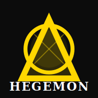

# Documentation Hub

This `docs/` tree centralizes contributor-facing material for the Hegemon monorepo. Everything here is considered normative alongside `DESIGN.md` and `METHODS.md`; when you change implementation code, update the relevant design/method sections *and* the docs entry that describes the behavior. The most useful entry points are:

- [`CONTRIBUTING.md`](CONTRIBUTING.md) – day-to-day workflows, required toolchains, CI entry points, and benchmarking instructions.
- [`THREAT_MODEL.md`](THREAT_MODEL.md) – explicit attacker assumptions, post-quantum (PQ) security margins, and mitigations for each subsystem.
- [`API_REFERENCE.md`](API_REFERENCE.md) – high-level overview of the Rust, Go, and (future) C++ APIs with links into `crypto/`, `circuits/`, `consensus/`, and `wallet/` implementations.
- [`CONSENSUS_AUDIT.md`](CONSENSUS_AUDIT.md) – spec ↔ implementation reconciliation for `hegemon-node`, plus consensus invariants that should be enforced in CI.
- [`USER_PRIVACY_GUIDELINES.md`](USER_PRIVACY_GUIDELINES.md) – end-user playbook for protecting wallet keys, node operations, and selective-disclosure workflows.
- [`COMPLIANCE_ARCHITECTURE.md`](COMPLIANCE_ARCHITECTURE.md) – how HEGEMON accommodates regulatory requirements (Travel Rule, sanctions screening, selective disclosure) without compromising privacy or introducing backdoors.
- [`CHAIN_SPECS.md`](CHAIN_SPECS.md) – chain specification checklists for Testnet0/1/2 and pre-mainnet, including bootstrapping keys and governance assumptions.
- [`SDK_DEVELOPER_GUIDE.md`](SDK_DEVELOPER_GUIDE.md) – how to extend the SDK surface area and work with feature flags during staged rollouts.

Each document calls out which sections of `DESIGN.md` and `METHODS.md` must be kept in sync so reviewers can verify that code, design, and docs evolve together. When adding a new crate, benchmark, or protocol feature, extend this hub and cross-reference the exact commit that introduced the change.
