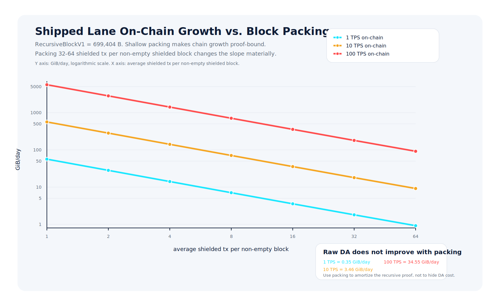
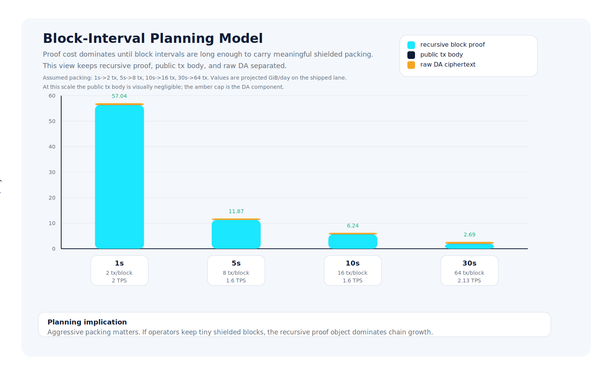

# Scalability Path

This document records the current honest deployment path for Hegemon `0.10.0`. It is an operator and topology reference, not a consensus specification.

## Current shipping architecture

The shipped shielded block path now has one canonical block-artifact lane:

- **Private or wallet-side proving edge**: wallets or private prover infrastructure produce canonical native `tx_leaf` artifacts for shielded transfers.
- **Public authoring layer**: the authoring node verifies and selects those native `tx_leaf` artifacts, derives the canonical semantic tuple from parent state plus tx order, builds one same-block `recursive_block_v1` artifact, and seals only when that recursive bundle is ready.
- **Public verification layer**: block import verifies the ordered native `tx_leaf` artifact stream plus the same-block `recursive_block_v1` artifact.

The shipped `0.10.0` path is therefore:

- wallets submit native `tx_leaf` artifacts,
- the authoring node verifies and selects those native artifacts,
- the authoring node builds one same-block `recursive_block_v1`,
- consensus verifies that recursive artifact against the canonical ordered verified-leaf stream.

There is no external public prover host in the normal shipping topology for this release.

## What is explicit experimental surface

Two block-proof lanes remain in-tree, but they are not the shipped product surface:

- **`ReceiptRoot`** is the explicit native comparison lane. It still carries a parent-bound commitment proof plus a native receipt-root artifact. It is useful for comparison, diagnostics, and research, but it is not the default shipped path.
- **`RecursiveBlockV2`** is the explicit experimental tree lane. It currently has a real bounded-domain invariant and explicit verification plumbing, but it is not the shipped default lane.

The old `InlineTx` label remains only as historical compatibility vocabulary and fail-closed handling. It is not a shipped non-empty shielded block mode.

## Immediate topology

The current deployment target stays simple:

- one public **authoring node** that accepts proof-ready shielded transactions, builds the same-block `recursive_block_v1`, mines, and broadcasts blocks;
- any number of **full nodes** that sync, verify, relay, and optionally run wallets;
- users proving transactions locally or through private infrastructure they trust.

Current approved public join seed list for miners and full nodes:

    HEGEMON_SEEDS="hegemon.pauli.group:30333"

All miners and verifiers in the same testnet must use the same approved `HEGEMON_SEEDS` value to avoid peer partitions and forks. The first public authoring node after a full reset should not seed itself; bring it up first, then use the join seed list on every other node. All mining hosts must keep NTP/chrony time sync enabled because PoW headers beyond the future-skew bound are rejected.

## What scales now

The main scaling levers on the shipped path are:

- more wallet-side or private-prover capacity, so more native `tx_leaf` artifacts are ready before block assembly;
- faster authoring-time compression of the ordered verified leaf stream into one `recursive_block_v1`;
- cheaper import-time verification of the ordered `tx_leaf` stream plus the recursive block artifact;
- lower ciphertext transport pressure through DA sidecars rather than inline payload growth.

This is the important architectural point: the fixed block artifact is not the only growth driver. Chain growth still scales with the ordered transaction set and ciphertext availability bytes. The recursive block artifact only keeps the block-validity proof component constant-width.

## Capacity planning and chain-growth model

This section is now a legacy deployment-planning model for the old two-step `RecursiveBlockV1` envelope, not a general steady-state recursion law. A current recursive-cap diagnostic shows that the `699,404`-byte `v1` width is only validated through the first `StepA` terminal; steady-state `StepB` on the same backend already projects to `1,870,731` bytes. Use the table below only as the historical `v1` two-step envelope model, not as a true constant-size packed-block model. For a bounded constant-size recursive lane, use `RecursiveBlockV2`.

### Assumptions

- shipped on-chain block artifact: `recursive_block_v1 = 699,404 B`
- experimental `RecursiveBlockV2 = 1,239,940 B` is not used for the shipped planning model
- proofless sidecar transfer public on-chain body: about `468 B/tx`
- raw DA ciphertext ingress: about `4,294 B/tx`
- values below are protocol payload only; they do not include RocksDB amplification, erasure-coding overhead, replication, or generic block/header/network framing

The current constants behind those assumptions are:

- `RECURSIVE_BLOCK_V1_ARTIFACT_MAX_SIZE = 699_404`
- `RECURSIVE_BLOCK_V2_ARTIFACT_MAX_SIZE = 1_239_940`
- `ENCRYPTED_NOTE_SIZE = 579`
- `MAX_KEM_CIPHERTEXT_LEN = 1568`
- `MAX_OUTPUTS = 2`

### Core formulas

Let:

- `T` = shielded TPS
- `k` = average shielded tx per non-empty shielded block

Then the shipped lane projects to:

```text
G_on(T, k) ~= 86400 * T * (468 + 699404 / k) bytes/day
           ~= T * (0.0377 + 56.28 / k) GiB/day

G_da(T)    ~= 86400 * T * 4294 bytes/day
           ~= 0.3455 * T GiB/day
```

Interpretation:

- `56.28 / k` GiB/day is the recursive-block proof cost amortized over `k` tx per non-empty shielded block
- `0.0377 * T` GiB/day is the public on-chain tx body growth
- `0.3455 * T` GiB/day is raw DA ciphertext ingress before erasure/sampling/replication overhead

### Block-packing study

Generated chart source: `scripts/render_scalability_plots.py`

All values below are projected `GiB/day` on the shipped `RecursiveBlockV1` lane.



| tx/block | on-chain @1 TPS | on-chain @10 TPS | on-chain @100 TPS | raw DA @1 TPS | raw DA @10 TPS | raw DA @100 TPS | total @1 TPS | total @10 TPS | total @100 TPS |
| ---: | ---: | ---: | ---: | ---: | ---: | ---: | ---: | ---: | ---: |
| 1 | 56.32 | 563.16 | 5631.61 | 0.35 | 3.46 | 34.55 | 56.66 | 566.62 | 5666.16 |
| 2 | 28.18 | 281.77 | 2817.69 | 0.35 | 3.46 | 34.55 | 28.52 | 285.22 | 2852.24 |
| 4 | 14.11 | 141.07 | 1410.73 | 0.35 | 3.46 | 34.55 | 14.45 | 144.53 | 1445.28 |
| 8 | 7.07 | 70.72 | 707.25 | 0.35 | 3.46 | 34.55 | 7.42 | 74.18 | 741.80 |
| 16 | 3.56 | 35.55 | 355.51 | 0.35 | 3.46 | 34.55 | 3.90 | 39.01 | 390.06 |
| 32 | 1.80 | 17.96 | 179.64 | 0.35 | 3.46 | 34.55 | 2.14 | 21.42 | 214.19 |
| 64 | 0.92 | 9.17 | 91.70 | 0.35 | 3.46 | 34.55 | 1.26 | 12.63 | 126.25 |

This is the main operator conclusion: chain growth is dominated by the fixed `recursive_block_v1` artifact until blocks are packed hard. Running at one shielded tx per non-empty block is storage-hostile. Packing `32-64` shielded tx per non-empty block makes the shipped lane materially more reasonable.

### Block-interval model

The table below converts the same sizing model into daily growth for a few practical target block intervals under one explicit packing assumption per interval. These are planning points, not measured authoring guarantees:

- `1s` block time: `2` shielded tx per non-empty block
- `5s` block time: `8` shielded tx per non-empty block
- `10s` block time: `16` shielded tx per non-empty block
- `30s` block time: `64` shielded tx per non-empty block

Those assumptions reflect the intended operational direction of the shipped lane: longer block intervals should be used to amortize the fixed recursive proof cost over more shielded transfers, not to produce the same tiny blocks more slowly.



| target block time | assumed tx/block | implied TPS | proof GiB/day | public tx body GiB/day | on-chain GiB/day | raw DA GiB/day | total GiB/day |
| ---: | ---: | ---: | ---: | ---: | ---: | ---: | ---: |
| 1s | 2 | 2.00 | 56.28 | 0.08 | 56.35 | 0.69 | 57.04 |
| 5s | 8 | 1.60 | 11.26 | 0.06 | 11.32 | 0.55 | 11.87 |
| 10s | 16 | 1.60 | 5.63 | 0.06 | 5.69 | 0.55 | 6.24 |
| 30s | 64 | 2.13 | 1.88 | 0.08 | 1.96 | 0.74 | 2.69 |

This interval view is useful for operators because it separates the two levers:

- shorter blocks reduce latency but multiply the fixed proof object frequency
- higher packing reduces the recursive proof amplification term directly

If compact chain growth is the priority, the shipped lane wants:

- `RecursiveBlockV1`, not `RecursiveBlockV2`
- proofless sidecar transfers, not inline per-tx proof transport
- aggressive packing of shielded tx into non-empty shielded blocks
- DA sidecars for ciphertext transport rather than inline ciphertext growth

## What the current split buys

The current split is:

- `transaction -> tx_leaf`
- `ordered verified tx_leaf stream -> recursive_block_v1`

That keeps the system operationally sane:

- transaction proving stays parallelizable at the edge;
- the chain sees one canonical block-validity object per non-empty shielded block;
- consensus and runtime do not need to switch between multiple live-looking block-proof contracts during normal operation;
- experimental lanes can stay in-tree without confusing the default release story.

## Sidecar staging contract

DA sidecar staging is intentionally local and ephemeral:

- `da_submitCiphertexts` and `da_submitProofs` are unsafe-only proposer/local RPCs, not public consensus APIs;
- staged ciphertexts and staged proof bytes live in proposer-local RAM only;
- a node restart drops those staged sidecars, so wallets/provers must restage before proofless `*_sidecar` transfers can be authored again.

That is the current recovery contract. Restart recovery is deterministic because the authoring node fail-closes or defers when local sidecar bytes are missing; it does not pretend those sidecars are durable chain state.

## Near-term roadmap

### Phase 0: ship the canonical recursive block lane

- wallets and private provers produce proof-ready native `tx_leaf` artifacts;
- block authors attach a same-block `recursive_block_v1`;
- full nodes verify the ordered native `tx_leaf` artifacts plus the recursive block artifact;
- no external prover-worker market, no public recursive work queue, no pooled/private-prover desktop roles.

### Phase 1: improve authoring throughput without changing the on-chain contract

Scale the parts that matter on the shipped lane:

- keep the prepared-bundle cache hot for exact repeats;
- keep the tx-leaf verification cache hot for near repeats;
- reduce recursive block proving latency on the authoring node;
- keep proof-ready tx throughput high enough that authoring rarely waits on aggregation.

### Phase 2: keep comparison lanes explicit

If operators or researchers want to run `ReceiptRoot` or `RecursiveBlockV2`, they should do so explicitly and measure them explicitly. Those lanes should not blur back into the shipped `0.10.0` release story.

### Phase 3: future compression work

If Hegemon later wants a different block proof, it must beat the current shipped lane on bytes, verifier cost, or authoring latency without weakening the release surface. That is a future cryptographic change, not an operational prerequisite for `0.10.0`.

## What is explicitly not current product surface

The following are not part of the current shipped `0.10.0` topology:

- `ReceiptRoot` as the default low-TPS block lane;
- `RecursiveBlockV2` as the default block lane;
- `InlineTx` as a valid non-empty shielded block lane;
- `hegemon-prover` as a required deployment host;
- any external prover-worker market as part of the normal authoring path;
- pooled hash-worker participation in the desktop app;
- private-prover participation in the desktop app.
