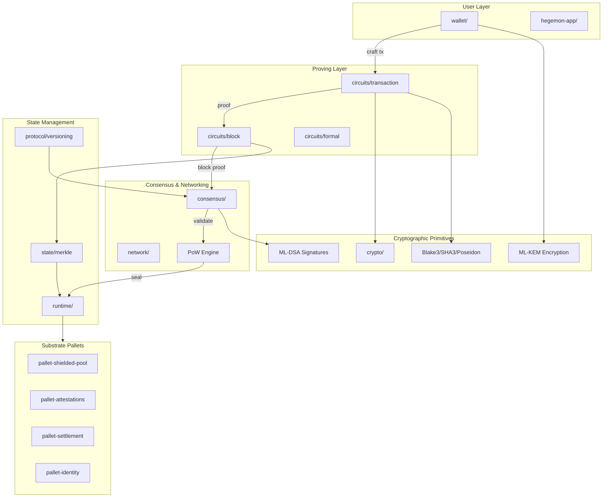
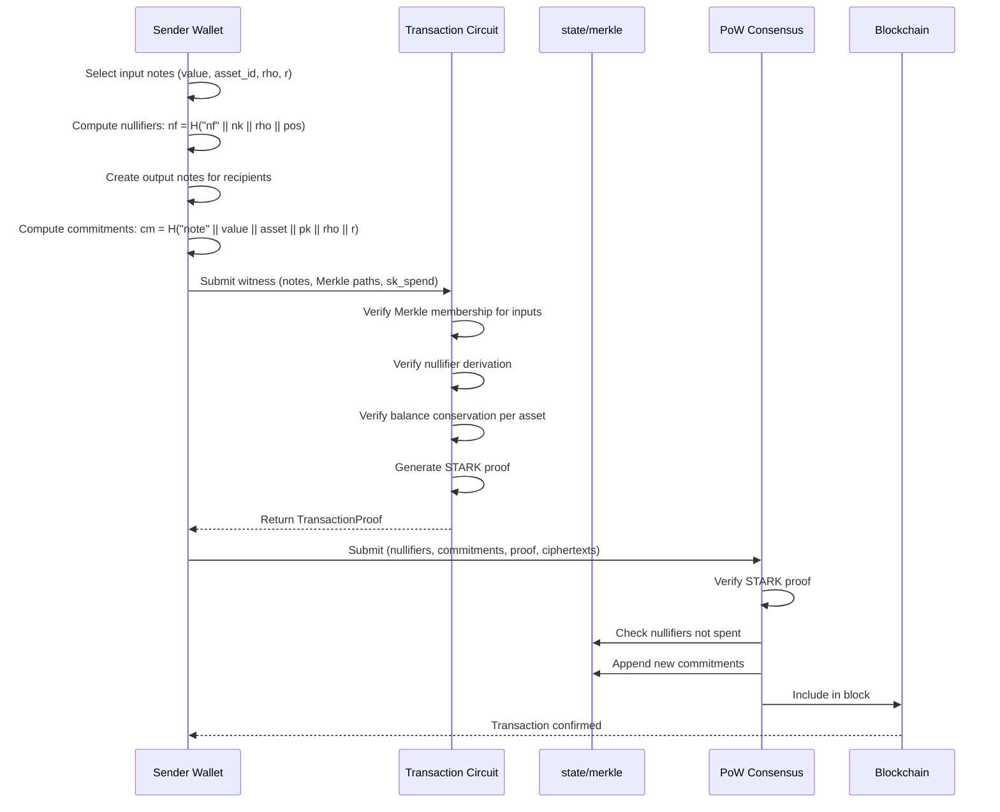
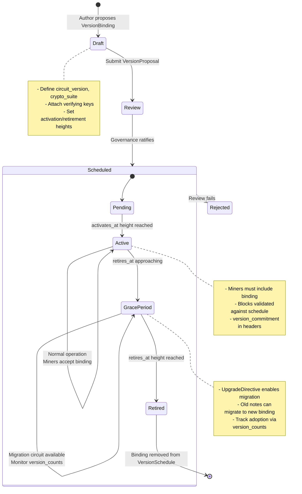
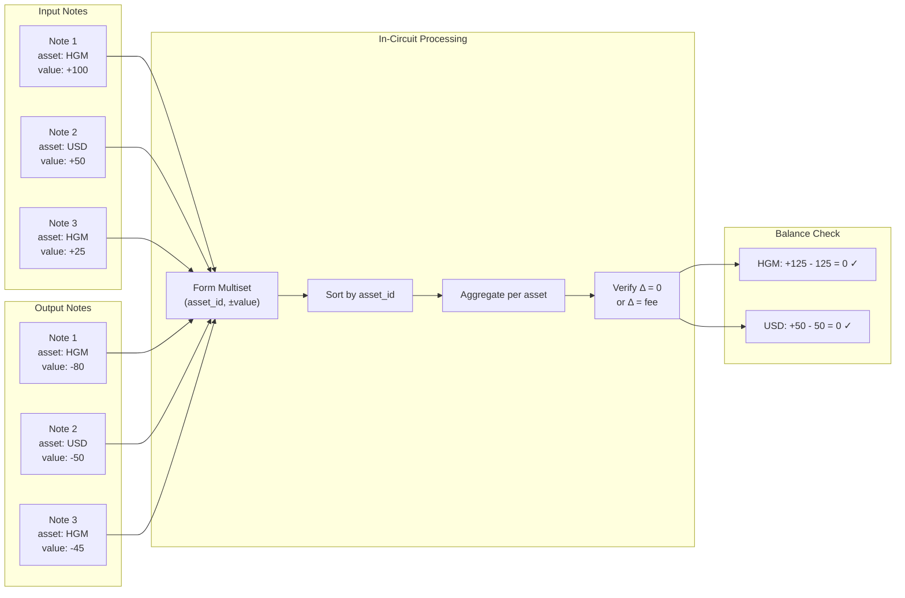
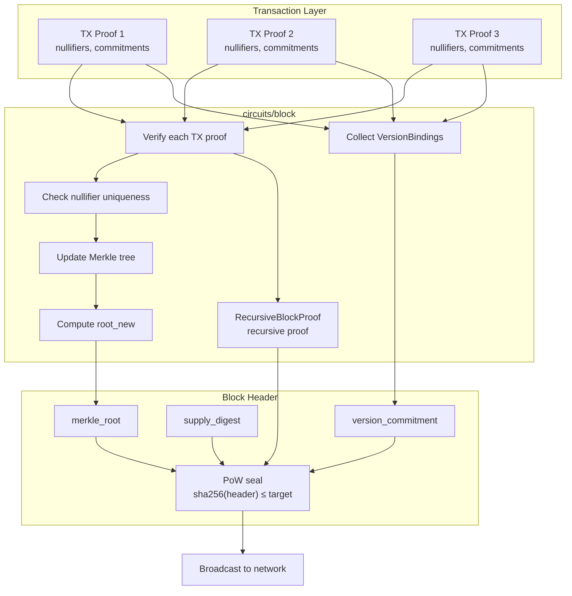

# Architecture Diagrams

This file contains Mermaid diagrams that visualize key architectural concepts from the whitepaper. Embed these in README.md, DESIGN.md, or METHODS.md as needed.

---

## 1. System Architecture Overview



---

## 2. Shielded Transaction Flow



---

## 3. Key Hierarchy

```mermaid
flowchart TD
    ROOT[sk_root<br/>256-bit master secret]

    ROOT -->|HKDF "spend"| SK_SPEND[sk_spend<br/>Spending key]
    ROOT -->|HKDF "view"| SK_VIEW[sk_view<br/>Viewing key]
    ROOT -->|HKDF "enc"| SK_ENC[sk_enc<br/>Encryption key]
    ROOT -->|HKDF "derive"| SK_DERIVE[sk_derive<br/>Diversifier key]

    SK_SPEND -->|H "nk"| NK[nk<br/>Nullifier key]
    NK -->|H "nf" + rho + pos| NF[Nullifiers]

    SK_VIEW --> ADDR_TAG[addr_tag_i<br/>Address tags]
    SK_ENC --> ML_KEM_KEYS[ML-KEM keypairs<br/>per diversifier]
    SK_DERIVE --> DIV[Diversified addresses]

    subgraph Viewing Keys
        IVK[Incoming VK<br/>sk_view + sk_enc]
        OVK[Outgoing VK<br/>can audit sent notes]
        FVK[Full VK<br/>IVK + vk_nf]
    end

    SK_VIEW --> IVK
    SK_ENC --> IVK
    SK_SPEND -->|H "view_nf"| VK_NF[vk_nf]
    VK_NF --> FVK
    IVK --> FVK

    DIV --> ADDR[Shielded Address<br/>shca1...]
    ML_KEM_KEYS --> ADDR
    ADDR_TAG --> ADDR
```

---

## 4. Version Upgrade Lifecycle



---

## 5. MASP Balance Conservation



---

## 6. Block Proof Aggregation



---

## Usage

To embed these diagrams in markdown files on GitHub:

1. Copy the desired diagram's Mermaid code block
2. Paste into README.md, DESIGN.md, or METHODS.md
3. GitHub will render the diagram automatically

For local preview, use:
- VS Code with Mermaid extension
- `mermaid-cli` (`npm install -g @mermaid-js/mermaid-cli`)
- Online editor: https://mermaid.live
